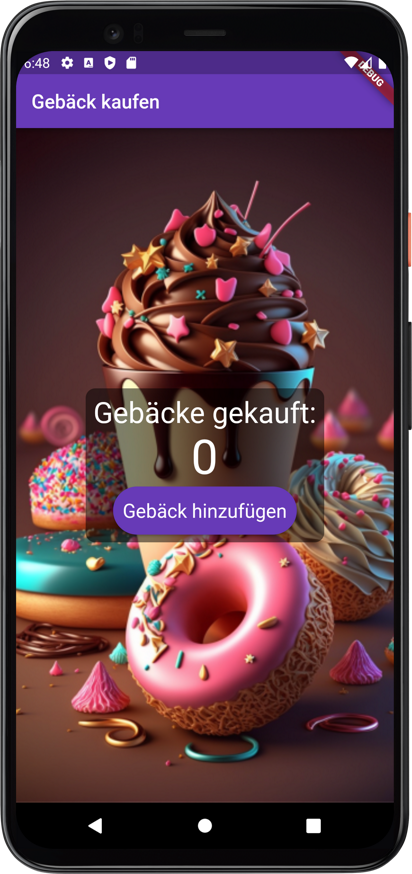

# Flutter-Code Dokumentation für My Pastries

Dieser Flutter-Code erstellt eine einfache App namens "My Pastries", in der ein Zähler angezeigt wird, der die Anzahl der gekauften Gebäcke angibt. Die App enthält eine Hintergrundabbildung, einen Text, der die Anzahl der gekauften Gebäcke anzeigt, und einen Button zum Hinzufügen von Gebäck.

## Hauptkomponenten

1. `MyApp`: Eine `StatelessWidget`-Klasse, die die Hauptanwendung darstellt.
2. `MainPage`: Eine `StatefulWidget`-Klasse, die die Startseite der App darstellt.
3. `_MainPageState`: Eine `State`-Klasse, die den Zustand der `MainPage` verwaltet.
4. `Scaffold`: Ein Layout-Widget, das eine AppBar und einen Body beinhaltet.
5. `Stack`: Ein Layout-Widget, das es ermöglicht, mehrere Widgets übereinander zu stapeln.

## Struktur

- Die `MyApp`-Klasse ist ein StatelessWidget und definiert die grundlegende Struktur der App, einschließlich des Titels, des Themas und der Startseite.
- Die `MainPage`-Klasse ist ein StatefulWidget und enthält die Logik zum Verwalten des Zählers.
- Die `_MainPageState`-Klasse enthält den Zähler und die Methode zum Erhöhen des Zählers (`_incrementCounter`).
- `Scaffold` bildet die grundlegende Struktur der Hauptseite, einschließlich der AppBar und des Body.
- Im Body wird ein `Stack`-Widget verwendet, um ein Hintergrundbild und einen zentrierten Container zu übereinander zu legen.
- Der zentrierte Container enthält den Text, der die Anzahl der gekauften Gebäcke anzeigt, und den Button zum Hinzufügen von Gebäck.

## Styling

- AppBar-Titel: Standard-Textstil.
- Zähler-Text: Schriftgröße 50, Farbe weiß.
- Text "Gebäcke gekauft": Schriftgröße 30, Farbe weiß.
- Button "Gebäck hinzufügen": Hintergrundfarbe `Colors.deepPurple`, Ecken abgerundet, Schriftgröße 20, Farbe weiß.

## Anmerkungen

- Die App verwendet ein Hintergrundbild, das über das `Image.asset`-Widget eingebunden wird. Das Bild wird auf die maximal verfügbare Größe skaliert, um den gesamten Bildschirm auszufüllen.
- Der Container, der den Text und den Button beinhaltet, hat abgerundete Ecken und einen halbtransparenten schwarzen Hintergrund.
- Der Button zum Hinzufügen von Gebäck ist ein `RawMaterialButton`, der individuell gestaltet wurde, um ein abgerundetes Rechteck und einen benutzerdefinierten Textstil zu verwenden.

## Verwendete Material-Widgets und Dokumentation

In der folgenden Tabelle finden Sie die Material-Widgets, die in der App verwendet werden, sowie Links zur offiziellen Dokumentation:

| Material-Widget       | Dokumentation                                              |
|-----------------------|------------------------------------------------------------|
| MaterialApp            | [MaterialApp Docs](https://api.flutter.dev/flutter/material/MaterialApp-class.html) |
| Scaffold              | [Scaffold Docs](https://api.flutter.dev/flutter/material/Scaffold-class.html) |
| AppBar                | [AppBar Docs](https://api.flutter.dev/flutter/material/AppBar-class.html) |
| FloatingActionButton   | [FloatingActionButton Docs](https://api.flutter.dev/flutter/material/FloatingActionButton-class.html) |
| Center                | [Center Docs](https://api.flutter.dev/flutter/widgets/Center-class.html) |
| Stack                 | [Stack Docs](https://api.flutter.dev/flutter/widgets/Stack-class.html) |
| Container             | [Container Docs](https://api.flutter.dev/flutter/widgets/Container-class.html) |
| BoxDecoration         | [BoxDecoration Docs](https://api.flutter.dev/flutter/painting/BoxDecoration-class.html) |
| BorderRadius          | [BorderRadius Docs](https://api.flutter.dev/flutter/painting/BorderRadius-class.html) |
| Padding               | [Padding Docs](https://api.flutter.dev/flutter/widgets/Padding-class.html) |
| Column                | [Column Docs](https://api.flutter.dev/flutter/widgets/Column-class.html) |
| Text                  | [Text Docs](https://api.flutter.dev/flutter/widgets/Text-class.html) |
| RawMaterialButton     | [RawMaterialButton Docs](https://api.flutter.dev/flutter/material/RawMaterialButton-class.html) |
| RoundedRectangleBorder | [RoundedRectangleBorder Docs](https://api.flutter.dev/flutter/painting/RoundedRectangleBorder-class.html) |

Diese Tabelle bietet einen schnellen Überblick über die verwendeten Material-Widgets und die zugehörigen Dokumentationslinks. Die Links führen zur offiziellen Flutter-Dokumentation, in der Sie weitere Informationen und Beispiele finden.
