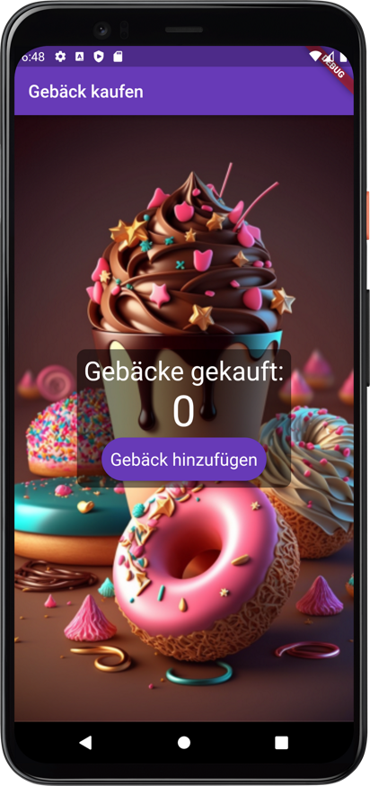

# Kapitel 1 - Einführung in Flutter

## Was wir lernen werden
  * Was ist Flutter?
  * Installation
    * https://docs.flutter.dev/get-started/install/windows
    * Android Studio
       * Plugins
       * Erstellen eines Emulators
       * Verbinden mit einem pysischen Mobil-Gerät
    * Flutter
    * Umgebungsvariablen
  * Erste App erstellen: MyPastries
    * Startet in main.dart, startet in main()
    * Kommentare `// Kommentar` oder `/* Mehrzeiliger Kommentar */`
    * MaterialApp => https://material.io
    * Layout Elemente
    * Eigene Widgets erstellen
    * Context Actions
    * Image Assets
    * App Icon
  * Erstellen der Zweiten App: MyCard
    * Hot Relaod
    * Stateless Widget => https://api.flutter.dev/flutter/widgets/StatelessWidget-class.html
    * Stateful Widget => https://api.flutter.dev/flutter/widgets/StatefulWidget-class.html


## Was wir programmieren werden
* MyPastries - Eine einfache App mit einem Button  
  

* MyCard - Eine App mit einem Profilbild und Text  


## Was wir gelernt haben
### Was ist Flutter?
 * Flutter ist ein Framework für die Entwicklung von Apps für Android und iOS
 * Flutter ist Open Source
 * Flutter passt sich an den Screensize an
 * Liefert Design- und Layout-Widgets: https://docs.flutter.dev/development/ui/widgets/material
 * Zeichnet auf Canvas
 * Hot Reload - Änderungen werden sofort angezeigt
 * Hot Restart - Neustart der App

 ### Design
 * Material-Widgets
 * Material-Icons
 * Styling von Widgets
 * Eigene Fonts
 * Eigene Bilder
-----

## Erste App
<details>
  <summary>Code</summary>

```dart
import 'package:flutter/material.dart';

void main() => runApp(MaterialApp(home: Text('Hello World!')));
```

</details>

### Erste App Step 1

<details>
  <summary>Code</summary>
  
```dart
import 'package:flutter/material.dart';

void main() => runApp(MaterialApp(home: Center(child: Text('Hello World!'),),),),;
```

</details>

### Erste App - Step 1_1
Durch Komma am Ende der Zeile wird ein Zeilenumbruch und Einrückung erzwungen

<details>
  <summary>Code</summary>
    
```dart
import 'package:flutter/material.dart';

void main() => runApp(
      MaterialApp(
        home: Center(
          child: Text('Hello World!'),
        ),
      ),
    );
```

</details>


### Erste App - Step 1_2
Fat Arrow Syntax ersetzen durch {}
Kommentare werden mit `//` eingeleitet

<details>
  <summary>Code</summary>
  
```dart
import 'package:flutter/material.dart';

// Diese Funktion wird beim Start der App aufgerufen
void main() {
  runApp(
    MaterialApp(
      home: Center(
        child: Text('Hello World!'),
      ),
    ),
  );
}
```

</details>

### Erste App - Step 2
Scaffold https://api.flutter.dev/flutter/material/Scaffold-class.html  
AppBar https://api.flutter.dev/flutter/material/AppBar-class.html  
Image https://api.flutter.dev/flutter/widgets/Image-class.html  

<details>
  <summary>Code</summary>
  
```dart
import 'package:flutter/material.dart';

void main() {
  runApp(
    MaterialApp(
      home: Scaffold(
        backgroundColor: Colors.blueGrey,
        appBar: AppBar(
          title: Text('My Pastries'),
          backgroundColor: Colors.deepPurple,
        ),
        body: Center(
          child: Image.asset('assets/images/pastry_bg.png'),
        ),
      ),
    ),
  );
}
```	

</details>

### Erste App - Step 2_1

<details>
  <summary>Code</summary>
  
```dart
import 'package:flutter/material.dart';

void main() {
  runApp(
    MaterialApp(
      home: Scaffold(
        backgroundColor: Colors.blueGrey,
        appBar: AppBar(
          title: Text('My Pastries'),
          backgroundColor: Colors.deepPurple,
        ),
        body: Center(
          child: Image.asset('assets/images/pastry_bg.png',
            fit: BoxFit.cover,
            height: double.infinity,
            width: double.infinity,
            alignment: Alignment.center,
          ),
        ),
      ),
    ),
  );
}
```

</details>

-----

## Zweite App - Challenge 1:
Erstelle eine App, welche:
 * Ein Scaffold hat
 * Die Hintergrundfarbe ist `teal` hat
 * Ein Container als body hat
Ändere die Hintegrundfarbe des Scaffolds auf `blueGrey`

Conainer: https://api.flutter.dev/flutter/widgets/Container-class.html

### Zweite App - Step 1


Hot Reload funktioniert nur bei Stateful Widgets oder Stateless Widgets

`stful` erzeugt ein Stateful Widget
`stless` erzeugt ein Stateless Widget

<details>
  <summary>Code</summary>
  
```dart
import 'package:flutter/material.dart';

void main() {
  runApp(
    MaterialApp(
      home: Scaffold(
        backgroundColor: Colors.teal,
        body: Container(),
      ),
    ),
  );
}
```

</details>

### Zweite App - Step 2
Mit `stless` erzeugen wir ein Stateless Widget

<details>
  <summary>Code</summary>
  
```dart
import 'package:flutter/material.dart';

void main() {
  runApp(
    const BCPage(),
  );
}

class BCPage extends StatelessWidget {
  const BCPage({Key? key}) : super(key: key);

  // Wird immer aufgerufen, wenn eine neue Version des Widgets gebaut werden soll
  // Wenn sich also etwas, wie die Farbe ändert, sucht Flutter nach der nächsten build Methode und ruft diese auf
  @override
  Widget build(BuildContext context) {
    return MaterialApp(
      home: Scaffold(
        backgroundColor: Colors.blueGrey,
        appBar: AppBar(
          centerTitle: true,
          title: Text('My Business Card'),
        ),
        body: Container(
          color: Colors.brown,
        ),
      ),
    );
  }
```

</details>

### Zweite App - Step 3
`SafeArea` https://api.flutter.dev/flutter/widgets/SafeArea-class.html  
`Margin`: Abstand des Containers zu den Seiten  
`Padding`: Abstand des Containers zum Inhalt  
`width` / `height`: Breite und Höhe des Containers

<details>
  <summary>Code</summary>
    
```dart
import 'package:flutter/material.dart';

void main() {
  runApp(
    const BCPage(),
  );
}

class BCPage extends StatelessWidget {
  const BCPage({Key? key}) : super(key: key);

  @override
  Widget build(BuildContext context) {
    return MaterialApp(
      home: Scaffold(
        backgroundColor: Colors.blueGrey,
        appBar: AppBar(
          centerTitle: true,
          backgroundColor: Colors.blueGrey[900],
          title: Text('My Business Card'),
        ),
        body: SafeArea(
          child: Container(
            margin: EdgeInsets.symmetric(horizontal: 20.0, vertical: 30.0),
            padding: EdgeInsets.all(20.0),
            width: 100,
            height: 100,
            color: Colors.brown,
            child: Text('Hello World'),
          ),
        ),
      ),
    );
  }
}
```

</details>

### Zweite App - Step 4
`Column` https://api.flutter.dev/flutter/widgets/Column-class.html   
`Row` https://api.flutter.dev/flutter/widgets/Row-class.html  

`Column` nimmt die Breite der Kinder Element und nimmt die ganze Höhe  
`Row` nimmt die Höhe der Kinder Element und nimmt die ganze Breite

`mainAxisAlignment: MainAxisAlignment.center` Zentriert die Kindelemente auf der Hauptachse (bei Column vertikal, bei Row horizontal)  
`verticalDirection: VerticalDirection.up` Ändert die Richtung in der die Kinder Elemente angeordnet werden  
`mainAxisSize: MainAxisSize.min` Minimiert die Größe des Containers auf der Hauptachse (bei Column auf die Höhe, bei Row auf die Breite) auf die Größe der Kinder Elemente  

### Zweite App - Step 5
`Container` in `Column` am Ende beginnen lassen
Durch hinzufügen eines Containers mit maximaler Breite
`double.infinity` https://api.flutter.dev/flutter/dart-core/double/infinity-constant.html  
`crossAxisAlignment: CrossAxisAlignment.stretch` Zieht die Kinder Elemente auf die maximale Breite des Containers  
`SizedBox` https://api.flutter.dev/flutter/widgets/SizedBox-class.html
Kann genutzt werden um Platz zwischen Elementen zu schaffen

```dart	
SizedBox(
  height: 20.0,
),
```

<details>
  <summary>Code</summary>

```dart
import 'package:flutter/material.dart';

void main() {
  runApp(
    const BCPage(),
  );
}

class BCPage extends StatelessWidget {
  const BCPage({Key? key}) : super(key: key);

  @override
  Widget build(BuildContext context) {
    return MaterialApp(
      home: Scaffold(
        backgroundColor: Colors.blueGrey,
        appBar: AppBar(
          centerTitle: true,
          backgroundColor: Colors.blueGrey[900],
          title: Text('My Business Card'),
        ),
        body: Column(
          mainAxisAlignment: MainAxisAlignment.start,
          verticalDirection: VerticalDirection.up,
          // crossAxisAlignment: CrossAxisAlignment.stretch,
          crossAxisAlignment: CrossAxisAlignment.end,
          children: [
            Container(
              width: 100,
              height: 100,
              color: Colors.brown,
              child: Text('Container_1'),
            ),
            Container(
              width: 300,
              height: 100,
              color: Colors.brown[900],
              child: Text('Container_2'),
            ),
            Container(
              width: 100,
              height: 100,
              color: Colors.teal[900],
              child: Text('Container_3'),
            ),
            Container(
              // width: double.infinity,
              height: 10,
              color: Colors.white,
              child: Text('Container_3'),
            ),
          ],
        ),
      ),
    );
  }
}

```

</details>

### Zweite App - Challenge 2:
Füge zwischen den Containern eine `SizedBox` mit einer Höhe von 20.0 hinzu

<details>
  <summary>Code</summary>

```dart
import 'package:flutter/material.dart';

void main() {
  runApp(
    const BCPage(),
  );
}

class BCPage extends StatelessWidget {
  const BCPage({Key? key}) : super(key: key);

  @override
  Widget build(BuildContext context) {
    return MaterialApp(
      home: Scaffold(
        backgroundColor: Colors.blueGrey,
        appBar: AppBar(
          centerTitle: true,
          backgroundColor: Colors.blueGrey[900],
          title: Text('My Business Card'),
        ),
        body: Column(
          mainAxisAlignment: MainAxisAlignment.start,
          verticalDirection: VerticalDirection.up,
          crossAxisAlignment: CrossAxisAlignment.stretch,
          // crossAxisAlignment: CrossAxisAlignment.end,
          children: [
            Container(
              // width: 100,
              height: 100,
              color: Colors.brown,
              child: Text('Container_1'),
            ),
            SizedBox(
              height: 20,
            ),
            Container(
              // width: 300,
              height: 100,
              color: Colors.brown[900],
              child: Text('Container_2'),
            ),
            SizedBox(
              height: 20,
            ),
            Container(
              // width: 100,
              height: 100,
              color: Colors.teal[900],
              child: Text('Container_3'),
            ),
            SizedBox(
              height: 20,
            ),
            Container(
              // width: double.infinity,
              height: 10,
              color: Colors.white,
              child: Text('Container_3'),
            ),
          ],
        ),
      ),
    );
  }
}

```

</details>

### Zweite App - Step 6
`Row` https://api.flutter.dev/flutter/widgets/Row-class.html
Rows verhalten sich ähnlich wie Columns, nur horizontal
Tausche `Column` gegen `Row` aus
Wo sind die `SizedBox` ?

<details>
  <summary>Code</summary>

```dart

```

</details>


### Zweite App - Step 7: Umstyling
* Lösche alle Elemente innerhalb der `body` des `Scaffold` Widgets
* Erstelle eine neue Ordner-Struktur `assets\images` und füge entweder `avatar_1.png` oder `avatar_2.png` hinzu
* Ergänze in `pubspec.yaml` die `assets` Sektion
* Füge dem Scaffold eine `SafeArea` hinzu
* Füge der `SafeArea` eine `Column` hinzu
* Füge der `Column` eine `CircleAvatar` hinzu (https://api.flutter.dev/flutter/material/CircleAvatar-class.html)
* Setzte die `radius` der `CircleAvatar` auf 50.0
* Setze foregroundImage des `CircleAvatar` auf `AssetImage('assets/images/avatar_1.png')` (AssetImage https://api.flutter.dev/flutter/painting/AssetImage-class.html)
* Füge ein Text Widget mit deinem Namen hinzu  
TextStyle https://api.flutter.dev/flutter/painting/TextStyle-class.html
* Passe den TextStyle wie folgt an:
  * `color: Colors.white`
  * `fontSize: 40.0`
  * `fontWeight: FontWeight.bold`


<details>
  <summary>Code</summary>

```dart
import 'package:flutter/material.dart';

void main() {
  runApp(
    const BCPage(),
  );
}

class BCPage extends StatelessWidget {
  const BCPage({Key? key}) : super(key: key);

  @override
  Widget build(BuildContext context) {
    return MaterialApp(
      home: Scaffold(
        backgroundColor: Colors.blueGrey,
        body: SafeArea(
          child: Column(
            children: [
              CircleAvatar(
                  foregroundImage: AssetImage('assets/images/avatar_1.png'),
                  radius: 50.0),
              Text(
                'Alex Smith',
                style: TextStyle(
                    fontSize: 40.0,
                    color: Colors.white,
                    fontWeight: FontWeight.bold),
              ),
            ],
          ),
        ),
      ),
    );
  }
}

```

</details>

### Zweite App - Step 8: Fonts
fonts.google.com - Frei zur kommerziellen Nutzung  
* Füge die ttf Datei in den Ordner `assets\fonts` hinzu
* Ergänze in `pubspec.yaml` die `fonts` Sektion:
```yaml
fonts:
  - family: Pacifico
    fonts:
      - asset: assets/fonts/Pacifico-Regular.ttf
```
* Füge im TextStyle die `fontFamily` hinzu
* Füge ein Text Widget mit deiner Berufsbezeichnung hinzu
* Lade eine passende Schriftart von fonts.google.com
  * z.B. Varela Round
  * Füge die ttf Datei in den Ordner `assets\fonts` hinzu
  * Ergänze in `pubspec.yaml` die `fonts` Sektion:
  ```yaml
* Passe den TextStyle deiner Berufsbezeichnung wie folgt an:
  * `color: Colors.blueGrey.shade100`
  * `fontSize: 20.0`
  * `fontWeight: FontWeight.bold`
  * `letterSpacing: 2.5`
  * `fontFamily: Varela Round`

<details>
  <summary>Code</summary>

```dart
import 'package:flutter/material.dart';

void main() {
  runApp(
    const BCPage(),
  );
}

class BCPage extends StatelessWidget {
  const BCPage({Key? key}) : super(key: key);

  @override
  Widget build(BuildContext context) {
    return MaterialApp(
      home: Scaffold(
        backgroundColor: Colors.blueGrey,
        body: SafeArea(
          child: Column(
            children: [
              CircleAvatar(
                  foregroundImage: AssetImage('assets/images/avatar_1.png'),
                  radius: 50.0),
              Text(
                'Alex Smith',
                style: TextStyle(
                    fontSize: 40.0,
                    color: Colors.white,
                    fontWeight: FontWeight.bold,
                    fontFamily: 'Pacifico'),
              ),
              Text(
                'KEY ACCOUNT MANAGER',
                style: TextStyle(
                    fontSize: 20.0,
                    color: Colors.blueGrey.shade100,
                    fontWeight: FontWeight.bold,
                    fontFamily: 'Varela',
                    letterSpacing: 2.5,
                ),
              ),
            ],
          ),
        ),
      ),
    );
  }
}
```
</details>

### Zweite App - Step 9: Material Icons und Widgets
* Füge nach dem Job-Titel, einen `Container` hinzu
* Der `Container` soll eine `Row` als `child` haben
  * Die `Row` soll als `children haben:
    * Ein `Icon` mit dem `Icons.phone` und `color: Colors.blueGrey.shade900` (https://api.flutter.dev/flutter/material/Icons-class.html) - (https://materialpalette.com)
    * Ein `SizedBox` mit `width: 10.0`
    * Ein `Text` Widget mit der Telefonnummer
    * Style den `Text` Widget wie folgt:
      * `color: Colors.blueGrey.shade900`
      * `fontSize: 20.0`
      * `fontFamily: Varela`
    * Ändere die Containerfarbe auf `Colors.white`
    * Setzte das `margin` auf `10.0` im vertikalen und '25.0' im horizontalen Bereich
    * Setzte das Padding des Container-Widgets auf `10.0` rundherum
    * Erstelle einen Zweiten Container mit den gleichen Eigenschaften wie der erste, welcher deine E-Mail Adresse enthält und das passende Icon verwendet

<details>
  <summary>Code</summary>

```dart
import 'package:flutter/material.dart';

void main() {
  runApp(
    const BCPage(),
  );
}

class BCPage extends StatelessWidget {
  const BCPage({Key? key}) : super(key: key);

  @override
  Widget build(BuildContext context) {
    return MaterialApp(
      home: Scaffold(
        backgroundColor: Colors.blueGrey,
        body: SafeArea(
          child: Column(
            children: [
              // Unser Avatar
              CircleAvatar(
                  foregroundImage: AssetImage('assets/images/avatar_1.png'),
                  radius: 50.0),
              // Unser Name
              Text(
                'Alex Smith',
                style: TextStyle(
                    fontSize: 40.0,
                    color: Colors.white,
                    fontWeight: FontWeight.bold,
                    fontFamily: 'Pacifico'),
              ),
              // Unser Job
              Text(
                'KEY ACCOUNT MANAGER',
                style: TextStyle(
                  fontSize: 20.0,
                  color: Colors.blueGrey.shade100,
                  fontWeight: FontWeight.bold,
                  fontFamily: 'Varela',
                  letterSpacing: 2.5,
                ),
              ),
              // Container für unsere Telefonnummer
              Container(
                color: Colors.white,
                margin: EdgeInsets.symmetric(vertical: 10.0, horizontal: 25.0),
                padding: EdgeInsets.all(10.0),
                child: Row(
                  children: [
                    Icon(Icons.phone, color: Colors.blueGrey.shade900),
                    SizedBox(width: 10.0),
                    Text(
                      '+49 151 4124 5221',
                      style: TextStyle(
                          color: Colors.blueGrey.shade900,
                          fontFamily: 'Varela',
                          fontSize: 20.0,
                      ),
                    ),
                  ],
                ),
              ),
              // Container für unsere E-Mail
              Container(
                color: Colors.white,
                margin: EdgeInsets.symmetric(vertical: 10.0, horizontal: 25.0),
                padding: EdgeInsets.all(10.0),
                child: Row(
                  children: [
                    Icon(Icons.alternate_email, color: Colors.blueGrey.shade900),
                    SizedBox(width: 10.0),
                    Text(
                      'kim.smith@needful-apps.de',
                      style: TextStyle(
                        color: Colors.blueGrey.shade900,
                        fontFamily: 'Varela',
                        fontSize: 16.5,
                      ),
                    ),
                  ],
                ),
              )
            ],
          ),
        ),
      ),
    );
  }
}
```

</details>


### Zweite App - Step 10: Divider und Card Widgets
Card Widgets sind sehr nützlich, um deine App zu strukturieren und deine Widgets zu gruppieren. (https://api.flutter.dev/flutter/material/Card-class.html)
* Tausche die `Container` für die Telefonnummer und Email gegen ein `Card` Widget aus
* Füge für den Inhalt der Card-Widgets ein `Padding` als parent hinzu.
* Setze das `padding`auf `EdgeInsets.all(20.0)`


<details>
  <summary>Code</summary>

```dart
import 'package:flutter/material.dart';

void main() {
  runApp(
    const BCPage(),
  );
}

class BCPage extends StatelessWidget {
  const BCPage({Key? key}) : super(key: key);

  @override
  Widget build(BuildContext context) {
    return MaterialApp(
      home: Scaffold(
        backgroundColor: Colors.blueGrey,
        body: SafeArea(
          child: Column(
            children: [
              // Unser Avatar
              CircleAvatar(
                  foregroundImage: AssetImage('assets/images/avatar_1.png'),
                  radius: 50.0),
              // Unser Name
              Text(
                'Alex Smith',
                style: TextStyle(
                    fontSize: 40.0,
                    color: Colors.white,
                    fontWeight: FontWeight.bold,
                    fontFamily: 'Pacifico'),
              ),
              // Unser Job
              Text(
                'KEY ACCOUNT MANAGER',
                style: TextStyle(
                  fontSize: 20.0,
                  color: Colors.blueGrey.shade100,
                  fontWeight: FontWeight.bold,
                  fontFamily: 'Varela',
                  letterSpacing: 2.5,
                ),
              ),
              // Container für unsere Telefonnummer
              Card(
                color: Colors.white,
                margin: EdgeInsets.symmetric(vertical: 10.0, horizontal: 25.0),
                child: Padding(
                  padding: const EdgeInsets.all(20.0),
                  child: Row(
                    children: [
                      Icon(Icons.phone, color: Colors.blueGrey.shade900),
                      SizedBox(width: 10.0),
                      Text(
                        '+49 151 4124 5221',
                        style: TextStyle(
                            color: Colors.blueGrey.shade900,
                            fontFamily: 'Varela',
                            fontSize: 20.0,
                        ),
                      ),
                    ],
                  ),
                ),
              ),
              // Container für unsere E-Mail
              Card(
                color: Colors.white,
                margin: EdgeInsets.symmetric(vertical: 10.0, horizontal: 25.0),
                child: Padding(
                  padding: const EdgeInsets.all(20.0),
                  child: Row(
                    children: [
                      Icon(Icons.alternate_email, color: Colors.blueGrey.shade900),
                      SizedBox(width: 10.0),
                      Text(
                        'kim.smith@needful-apps.de',
                        style: TextStyle(
                          color: Colors.blueGrey.shade900,
                          fontFamily: 'Varela',
                          fontSize: 16.5,
                        ),
                      ),
                    ],
                  ),
                ),
              )
            ],
          ),
        ),
      ),
    );
  }
}

```

</details>

### Zweite App - Step 10.1: Divider und Card Widgets
ListTiles kommen vorgefertigt mit Leading-Widget und einem Title-Widget (https://api.flutter.dev/flutter/material/ListTile-class.html)
* Tausche die `Row` für die Telefonnummer und Email gegen ein `ListTile` Widget aus
* Entferne die Padding Widgets
* Zentriere den Inhalt der Column
* Füger eine SizedBox zwischen dem Job-Title und der Telefonnummer ein. Sie soll 20.0 Pixel hoch sein.
* Füge einen Devider in die SizedBox als child ein. (https://api.flutter.dev/flutter/material/Divider-class.html)


<details>
  <summary>Code</summary>

```dart
import 'package:flutter/material.dart';

void main() {
  runApp(
    const BCPage(),
  );
}

class BCPage extends StatelessWidget {
  const BCPage({Key? key}) : super(key: key);

  @override
  Widget build(BuildContext context) {
    return MaterialApp(
      home: Scaffold(
        backgroundColor: Colors.blueGrey,
        body: SafeArea(
          child: Column(
            mainAxisAlignment: MainAxisAlignment.center,
            children: [
              // Unser Avatar
              CircleAvatar(
                  foregroundImage: AssetImage('assets/images/avatar_1.png'),
                  radius: 50.0),
              // Unser Name
              Text(
                'Kim Smith',
                style: TextStyle(
                    fontSize: 40.0,
                    color: Colors.white,
                    fontWeight: FontWeight.bold,
                    fontFamily: 'Pacifico'),
              ),
              // Unser Job
              Text(
                'KEY ACCOUNT MANAGER',
                style: TextStyle(
                  fontSize: 20.0,
                  color: Colors.blueGrey.shade100,
                  fontWeight: FontWeight.bold,
                  fontFamily: 'Varela',
                  letterSpacing: 2.5,
                ),
              ),
              // Trennlinie
              SizedBox(
                height: 20.0,
                width: 150.0,
                child: Divider(
                  color: Colors.blueGrey.shade100,
                ),
              ),
              // Container für unsere Telefonnummer
              Card(
                color: Colors.white,
                margin: EdgeInsets.symmetric(vertical: 10.0, horizontal: 25.0),
                child: ListTile(
                  leading: Icon(Icons.phone, color: Colors.blueGrey.shade900),
                  title: Text(
                    '+ 49 151 4124 5221',
                    style: TextStyle(
                        color: Colors.blueGrey.shade900,
                        fontFamily: 'Varela',
                        fontSize: 19.0),
                  ),
                ),
              ),
              // Container für unsere E-Mail
              Card(
                color: Colors.white,
                margin: EdgeInsets.symmetric(vertical: 10.0, horizontal: 25.0),
                child: ListTile(
                  leading: Icon(Icons.alternate_email,
                      color: Colors.blueGrey.shade900),
                  title: Text(
                    'kim.smith@needful-apps.de',
                    style: TextStyle(
                      color: Colors.blueGrey.shade900,
                      fontFamily: 'Varela',
                      fontSize: 19,
                    ),
                  ),
                ),
              )
            ],
          ),
        ),
      ),
    );
  }
}
```

</details>

-----

### Blank App

<details>
  <summary>Code</summary>
  
```dart
import 'package:flutter/material.dart';

void main() => runApp(MyApp());

class MyApp extends StatelessWidget {

  @override
  Widget build(BuildContext context) {
    return MaterialApp(
      home: MainPage(),
    );
  }
}

class MainPage extends StatefulWidget {
  @override
  State<MainPage> createState() => _MainPageState();
}

class _MainPageState extends State<MainPage> {

    @override
    Widget build(BuildContext context) {
        return Scaffold();
    }
}
```
</details>

-----


</details>