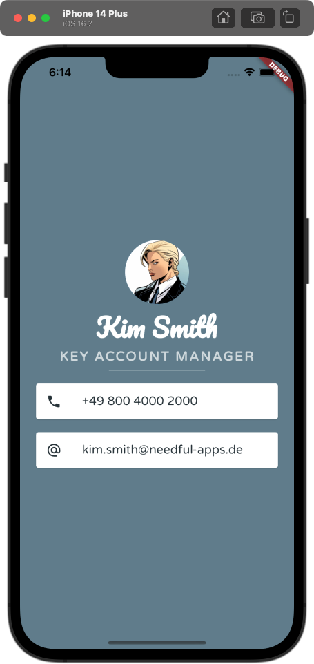

# Flutter-Code Dokumentation - My Card App

Dieser Flutter-Code erstellt eine einfache Visitenkarten-App, die Informationen wie Avatar, Name, Job, Telefonnummer und E-Mail-Adresse anzeigt.

## Hauptkomponenten

1. `BCPage`: Eine `StatelessWidget`-Klasse, die die Hauptseite der Visitenkarten-App darstellt.
2. `CircleAvatar`: Zeigt den Avatar des Benutzers.
3. `Text`: Zeigt den Namen und den Job des Benutzers an.
4. `SizedBox`: Eine Trennlinie zwischen dem Jobtitel und den Kontaktinformationen.
5. `Card`: Container für die Telefonnummer und die E-Mail-Adresse.

## Struktur

- Die `BCPage`-Klasse ist ein StatelessWidget und baut die Hauptseite der Visitenkarten-App.
- `MaterialApp` und `Scaffold` bilden die Grundstruktur der App.
- Der Hintergrund der App ist `Colors.blueGrey`.
- Der Hauptinhalt der App ist in einer `SafeArea` eingeschlossen, um auf verschiedenen Geräten korrekt angezeigt zu werden.
- Ein `Column`-Widget wird verwendet, um alle Elemente der Visitenkarte vertikal anzuordnen.
- `CircleAvatar` zeigt das Benutzer-Avatar-Bild.
- Zwei `Text`-Widgets zeigen den Namen und den Job des Benutzers an.
- Eine `SizedBox` mit einem `Divider`-Widget erstellt eine Trennlinie.
- Zwei `Card`-Widgets werden verwendet, um die Telefonnummer und die E-Mail-Adresse darzustellen, jeweils mit einem passenden Icon (`Icons.phone` und `Icons.alternate_email`).

## Styling

- Name: Schriftart 'Pacifico', Größe 40.0, Farbe weiß und fett.
- Job: Schriftart 'Varela', Größe 20.0, Farbe `Colors.blueGrey.shade100`, fett und 2.5 Buchstabenabstand.
- Telefonnummer und E-Mail-Adresse: Schriftart 'Varela', Größe 19.0, Farbe `Colors.blueGrey.shade900`.
