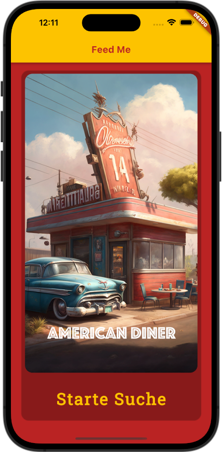
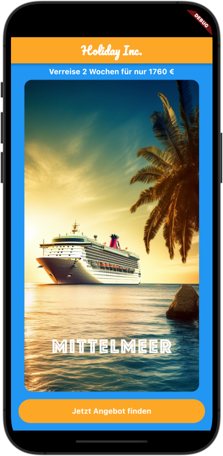

# Kapitel 2 - Erste Programmlogik

## Was wir lernen werden
* Click / Touch Events
* Einfache Verzweigungen
* Schleifen
* Funktionen
* iOS-AppIcon


## Was wir programmieren werden

| Feed Me eine App, die uns hilft, uns für ein Restaurant zu entscheiden | Holiday Inc. - Findet ein Reiseziel, Reisedauer und den passenden Preis dazu. Per Zufall.  |
|---------------------------------------------------------|---------------------------------------------------------|
|    |     |


## Feed Me 1.0
* Erstelle ein neues Projekt
* Erstelle die Ordnerstruktur `assets/images`
* Füge die folgenden Dateien dort ein:
  - diner_1.png
  - diner_2.png
  - diner_3.png
  - diner_4.png
  - diner_5.png
  - diner_6.png
  - FeedMeIcon.PNG
* Erstelle die `asset`-Sektion in der pubspec.yaml
  * Füge die folgenden Zeilen ein:
  ```yaml
  - assets:
    - assets/images/
  ```
  Damit werden alle Dateinen im Ordner `assets/images` geladen.

* Füge auf bekanntem Weg, die Schriftart `Roboto Slab` hinzu
* Tausche den Inhalt der `main.dart` gegen den folgenden Code aus:
    <details>
    <summary>Code</summary>
        
    ```dart
    import 'package:flutter/material.dart';

    void main() {
    runApp(const FeedMeApp());
    }

    class FeedMeApp extends StatelessWidget {
    const FeedMeApp({super.key});

    @override
    Widget build(BuildContext context) {
        return MaterialApp(
        title: 'Feed Me',
        home: Scaffold(
            backgroundColor: Color(0xffba2323),
            appBar: AppBar(
            backgroundColor: Color(0xFFFFC300),
            title: Text(
                'Feed Me',
                style:
                TextStyle(color: Color(0xffba2323), fontWeight: FontWeight.bold),
            ),
            ),
            body: Center(
            child: Container(),
            ),
        ),
        );
    }
    }
    ```
    </details>    
* Setze das Android Icon auf `FeedMeIcon.PNG`

### Feed Me App - Flutter Source Code

Hier ist eine kurze Zusammenfassung des bisherigen Source Codes:

1. Importieren des `flutter/material.dart` Pakets.
2. Definition der `main()` Funktion, welche `FeedMeApp` als Haupt-App-Widget ausführt.
3. `FeedMeApp` ist ein `StatelessWidget`, das die Grundstruktur der App enthält. Es definiert das App-Theme und die Hauptseite.
   - Das ThemeData beinhaltet die Primär- und Sekundärfarben, welche für das gesamte App-Design verwendet werden.
4. `MainPage` ist ein `StatefulWidget`, das die Hauptseite der App darstellt.
   - `_MainPageState` ist der zugehörige State für das `MainPage` Widget.
5. `_MainPageState` enthält die `build` Methode, die das Design der Hauptseite erstellt:
   - Der Hintergrund der `Scaffold` ist auf die Sekundärfarbe eingestellt.
   - Die `AppBar` verwendet die Primärfarbe als Hintergrund, und der Titeltext ist in Sekundärfarbe und fett gedruckt.
   - Der Hauptteil der Seite enthält eine zentrierte `Card` mit abgerundeten Ecken und transparenter Farbe.
     - Im Inneren der `Card` befindet sich das FeedMeIcon-Bild, gefolgt von einem `SizedBox` für Abstand.
     - Darunter steht der Text "Starte Suche" in Primärfarbe, größerer Schriftgröße, breiterem Buchstabenabstand, fetter Schrift und Roboto_Slab-Schriftart.
     - Ein weiterer `SizedBox` wird verwendet, um Abstand am Ende der Card hinzuzufügen.

* Gehe auf appicon.co und erstelle ein neues App-Icon für die App.
  * Lade das Icon-Set herunter
  * Lösche im iOS-Ordner den Ordner Assets.xcassets
  * Füge aus der Zip-Datei den Ordner Assets.xcassets in den iOS-Ordner ein
  * Dein App-Icon sollte nun verwendet werden
* Tausche den Inhalt des Container-Widgets gegen folgende Struktur aus:
  * Eine `Card` mit folgenden Eigenschaften:
    * Die Farbe der `Card` ist transparent
    * Die `shape` ist auf `RoundedRectangleBorder` gesetzt
    * Die `borderRadius` ist auf 16.0 gesetzt
    * Das `child` ist eine `Column` mit folgenden Eigenschaften:
      * Die `mainAxisSize` ist auf `MainAxisSize.min` gesetzt
      * Das `children`-Attribut enthält folgende Widgets:
        * Ein `Image.asset` mit folgenden Eigenschaften:
          * Das `asset`-Attribut ist auf `assets/images/diner_1.png` gesetzt
        * Ein `SizedBox` mit folgenden Eigenschaften:
          * Die `height` ist auf 16.0 gesetzt
        * Ein `Text`-Widget mit folgenden Eigenschaften:
          * Der `text` ist auf `Starte Suche` gesetzt
          * Die `style` ist auf folgende Eigenschaften gesetzt:
            * Die `color` ist auf `Color(0xFFFFC300)` gesetzt
            * Die `fontSize` ist auf 35.0 gesetzt
            * Die `letterSpacing` ist auf 2.5 gesetzt
            * Die `fontWeight` ist auf `FontWeight.bold` gesetzt
            * Die `fontFamily` ist auf `Roboto_Slab` gesetzt
        * Ein weiteres `SizedBox` mit folgenden Eigenschaften:
          * Die `height` ist auf 16.0 gesetzt
  * Dein Code sollte nun so aussehen:
    <details>
    <summary>Code</summary>
            
    ```dart
    import 'package:flutter/material.dart';

    void main() {
    runApp(const FeedMeApp());
    }

    class FeedMeApp extends StatelessWidget {
    const FeedMeApp({super.key});

    @override
    Widget build(BuildContext context) {
        return MaterialApp(
        title: 'Feed Me',
        home: SafeArea(
            child: Scaffold(
            backgroundColor: Color(0xffba2323),
            appBar: AppBar(
            backgroundColor: Color(0xFFFFC300),
            title: Text(
                'Feed Me',
                style: TextStyle(
                    color: Color(0xffba2323), fontWeight: FontWeight.bold),
            ),
            ),
            body: Center(
                child: Card(
                color: Color(0x00),
                margin: EdgeInsets.all(16.0),
                shape: RoundedRectangleBorder(
                    borderRadius: BorderRadius.circular(16.0),
                ),
                child: Column(
                    mainAxisSize: MainAxisSize.min,
                    children: [
                    Expanded(
                        child: Padding(
                            padding: const EdgeInsets.all(8.0),
                            child: ClipRRect(
                            child: Image.asset('assets/images/diner_1.png'),
                            borderRadius: BorderRadius.circular(16.0),
                            ),
                        )),
                    SizedBox(height: 16.0),
                    Text(
                        'Starte Suche',
                        style: TextStyle(
                            color: Color(0xFFFFC300),
                            fontSize: 35.0,
                            letterSpacing: 2.5,
                            fontWeight: FontWeight.bold,
                            fontFamily: 'Roboto_Slab'),
                    ),
                    SizedBox(height: 16.0),
                    ],
                ),
                ),
            ),
            ),
        ),
        );
    }
    }

    ```    
    </details>
  * Die App zeigt einen schwarz/gelben Balken an, da das Bild zu groß für den Anzeigebereich ist.
  * Mit Hilfe des [`Expanded`](https://api.flutter.dev/flutter/widgets/Expanded-class.html) Widgets kann das Bild auf die gesamte Höhe des Anzeigebereichs angepasst werden.
  * Setze ein `Padding`-Widget um das `Image.asset`-Widget mit einem `padding` von 16.0
  * Setze ein `SafeArea`-Widget um das `Scaffold`-Widget  
  * Gebe der `Card`ein `margin` von 16.0
  * Setze ein [`ClipRRect`](https://api.flutter.dev/flutter/widgets/ClipRRect-class.html)-Widget um das `Image.asset`-Widget mit einer `borderRadius` von 16.0 um die Ecken abzurunden 
  * Verschiebe das `Padding`-Widget so, dass es das `ClipRRect`-Widget umschließt  
  * Dein Code sollte nun so aussehen:
    <details>
    <summary>Code</summary>
            
    ```dart
    import 'package:flutter/material.dart';

    void main() {
        runApp(const FeedMeApp());
    }

    class FeedMeApp extends StatelessWidget {
    const FeedMeApp({super.key});

    @override
    Widget build(BuildContext context) {
            return MaterialApp(
            title: 'Feed Me',
            home: Scaffold(
                    backgroundColor: Color(0xffba2323),
                    appBar: AppBar(
                    backgroundColor: Color(0xFFFFC300),
                    title: Text(
                        'Feed Me',
                        style: TextStyle(
                            color: Color(0xffba2323), fontWeight: FontWeight.bold),
                        ),
                    ),
                    body: SafeArea(
                    child: Center(
                            child: Card(
                            color: Color(0x00),
                            margin: EdgeInsets.all(16.0),
                            shape: RoundedRectangleBorder(
                                borderRadius: BorderRadius.circular(16.0),
                            ),
                            child: Column(
                                    mainAxisSize: MainAxisSize.min,
                                    children: [
                                    Expanded(
                                        child: Padding(
                                            padding: const EdgeInsets.all(8.0),
                                            child: ClipRRect(
                                                child: Image.asset('assets/images/diner_1.png'),
                                                borderRadius: BorderRadius.circular(16.0),
                                                ),
                                            ),
                                        ),
                                    SizedBox(height: 16.0),
                                    Text(
                                        'Starte Suche',
                                        style: TextStyle(
                                            color: Color(0xFFFFC300),
                                            fontSize: 35.0,
                                            letterSpacing: 2.5,
                                            fontWeight: FontWeight.bold,
                                            fontFamily: 'Roboto_Slab'),
                                    ),
                                    SizedBox(height: 16.0),
                                    ],
                                ),
                            ),
                        ),
                    ),
                ),
            );
        }
    }

    ```    
    </details>

## Feed Me Step 2
Jetzt da unser Design steht, können wir die erste Progammlogik hinzufügen.
Dazu benötigen wir einen Button, welcher auf Touch-Ereignisse reagiert: https://docs.flutter.dev/development/ui/widgets/material#Buttons  
Wir wollen, dass sich der Text 'Suche starten' anklicken lässt und sich das Bild ändert. Dazu wählen wir den `TextButton` aus:

* Setze einen `TextButton` um den Text 'Starte Suche'
* Setze ein `onPressed`-Attribut mit einer leeren Funktion
  * Void-Callbacks sind Funktionen, die keinen Rückgabewert haben. Sie werden mit `() {}` definiert.
  * Füge eine `print()`-Funktion mit dem Text 'Starte Suche' ein

### Feed Me Step 2.1 - Was sind Funktionen?
Als Programmierer schreiben wir in Funktionen Blöcke von Code, die wir immer dann aufrufen können, wenn wir sie brauchen.
Funktionen sind also wiederverwendbare Codeblöcke.  
Der Vorgang, morgens aufzustehen und sich anzuziehen, die Zeitung rein zu holen und den ersten Kaffee zu kochen, ist ein Beispiel für eine Funktion.
Ohne Funktionen, müssen diese Schritte jeden Morgen neu definiert werden.
Stattdessen definieren wir eine Funktion `starteTag()` und packen die Anweisungen in einen Block der mit geschwungenen Klammern umschlossen wird `{}` und rufen diese Funktion immer dann auf, wenn wir morgens aufstehen wollen.  
Eine solche Funktion sieht in Dart so aus:
```dart
void starteTag() {
  // Anweisungen
}
```
Diesen Funktionstyp nennt man Named Function. Die hat den Namen `starteTag`  
Eine andere Möglichkeit, eine Funktion zu definieren, ist die Anonymous Function. Diese hat keinen Namen und wird direkt an die Stelle geschrieben, an der sie aufgerufen werden soll: 
```dart
() {
  // Anweisungen
}
``` 

### Feed Me Step 2.2 - Funktionalität für das Touch-Event
* Wir erstellen zunächst eine Variable mit dem Namen `diceThrow` und initialisieren sie mit dem Wert `2`:
    ```dart
    var diceThrow = 2;
    ```
* Passe den Namen des Bildes im `Image.asset` an:
    ```dart
    class FeedMeApp extends StatelessWidget {
        FeedMeApp({super.key});
        Image.asset('assets/images/diner_$diceThrow.png'),
        ...
    ```
* Verschiebe die Variable `diveThrow` unter die Zeile `Widget build(BuildContext context) {`

### Feed Me Step 2.3 - Variablen und Datentypen
Variablen sind mit Kontainern vergleichbar. In ihnen können wir Werte speichern und später wieder abrufen.
```dart
// Mit "myName" benamter Kontainer mit "Kim" als Inhalt
var myName = 'Kim';
// Gebe den Inhalt des Kontainers aus
print(myName);
```
Probiere diesen Code auf https://dartpad.dev/ aus.
* Füge die folgenden Zeilen hinzu:
    ```dart
    myName = 'Alex';
    print(myName);
    ```
* Füge die folgenden Zeilen hinzu:
    ```dart
    myName = 123;
    print(myName);
    ```

Dart ist eine statisch typisierte Sprache. Das bedeutet, dass Variablen einen Datentyp haben müssen.  
Bei der Erstellung der Variable wird der Datentyp festgelegt. Dieser kann nicht mehr geändert werden.  
Mit dem Schlüsselwort `var` wird der Datentyp automatisch ermittelt.  
Da wir den Wert `'Kim'` zuweisen, wird der Datentyp `String` festgelegt.  
Wenn wir statt `'Kim'` die Zahl `123` zuweisen, wird der Datentyp `int` festgelegt.  
Int steht für Integer und ist die englische Bezeichnung für Ganzzahl. Es können also keine Kommazahlen verwendet werden.  
Für Kommazahlen gibt es den Datentyp `double`: `var myDouble = 1.23;`  
Der letzte Datentyp ist `bool`. Dieser steht für Boolean und kann nur den Wert `true` oder `false` annehmen.  
Diese Datentypen werden auch als Primitive Datentypen bezeichnet.

* Gebe folgendes in Dartpad ein:
    ```dart
    var myName = 'Kim'; // String
    var myAge = 23; // int
    var myHeight = 1.87; // double
    var isMarried = false; // bool

    var inMyBackpack;
  
    inMyBackpack = 'Shoes';
    inMyBackpack = 455;

    String dogName;
    dogName = 'Brutus';
    dogName = 123;
    ```

* Ändere in der App den Datentyp von `diceThrow` auf `int` und setze den Wert wieder auf `1` und setze die Zeile wieder  unter die Klassen-Definition:
    ```dart
    class FeedMeApp extends StatelessWidget {
        int diceThrow = 1;
    ```
    Wir sehen dass `FeedMeApp` nun unterstrichen ist. Das zeigt uns, dass wir in einem `StatlessWidget` keine Variablen definieren sollen.
    Der Inhalt von `StatelessWidgets` ist als immer gleich zu betrachten. Eine `Column` bleibt immer eine `Column`.  
      
    Wenn sich also der Pfad zum Bild ändern soll, ist dies am besten mit einem `StatefulWidget` möglich.

### Feed Me Step 2.4 - Stateful und Stateless Widgets
Wir wollen nun, dass sich mit jedem Klick auf den Button das Bild ändert. Dazu müssen wir den Wert der Variable `diceThrow` jedesmal ändern, wenn der Button gedrückt wird.


#### Feed Me Step 2.4.1 - Was ist ein State?
Der State gibt den Zustand des Widgets an.
Habe ich etwa eine Spülmaschine in der drei Teller sind, so ist dies der State. Füge ich zwei Tassen hinzu, ändert sich der State. 
Wollen wir also unser Bild ändern, müssen wir den State ändern.

* Kollabiere das `StatelessWidget` und erstelle darunter mit dem Kurzbefehl `stful` ein `StatefulWidget`.

<details>
<summary>Code</summary>

```dart
// Dies ist der Widget-Abschnitt
class FeedMePage extends StatefulWidget {
  const FeedMePage({Key? key}) : super(key: key);

  @override
  State<FeedMePage> createState() => _FeedMePageState();
}

// Dies ist der State-Abschnitt
class _FeedMePageState extends State<FeedMePage> {
  @override
  Widget build(BuildContext context) {
    return const Placeholder();
  }
}
```
</details>

* Kopiere alles aus dem `StatelessWidget` in das `StatefulWidget` und lösche das `StatelessWidget`.
* Ändere den Aufruf des `StatefulWidget` in der `main()`-Funktion:
    ```dart
    void main() {
      runApp(const FeedMePage());
    }
    ```
* Ändere nun den Inhalt des `onPressed`-Callbacks auf:
    ```dart
    onPressed: () {
        diceThrow = 3;
    },
    ```
* Noch ändert sich nichts, da wir den State nicht aktualisieren.  
    Um der App mitzuteilen, dass sich der State geänder hat, verwenden wir die Methode `setState()`:
    ```dart
    onPressed: () {
        setState(() {
            diceThrow = 3;
        });
    },
    ```
Dein Code sollte nun so aussehen:
<details>
<summary>Code</summary>

```dart
import 'package:flutter/material.dart';

void main() {
  runApp(const FeedMePage());
}

class FeedMePage extends StatefulWidget {
  const FeedMePage({Key? key}) : super(key: key);

  @override
  State<FeedMePage> createState() => _FeedMePageState();
}

class _FeedMePageState extends State<FeedMePage> {
  int diceThrow = 1;

  @override
  Widget build(BuildContext context) {
    return MaterialApp(
      title: 'Feed Me',
      home: Scaffold(
        backgroundColor: Color(0xffba2323),
        appBar: AppBar(
          backgroundColor: Color(0xFFFFC300),
          title: Text(
            'Feed Me',
            style: TextStyle(
                color: Color(0xffba2323), fontWeight: FontWeight.bold),
          ),
        ),
        body: SafeArea(
          child: Center(
            child: Card(
              color: Color(0x00),
              margin: EdgeInsets.all(16.0),
              shape: RoundedRectangleBorder(
                borderRadius: BorderRadius.circular(16.0),
              ),
              child: Column(
                mainAxisSize: MainAxisSize.min,
                children: [
                  Expanded(
                      child: Padding(
                        padding: const EdgeInsets.all(8.0),
                        child: ClipRRect(
                          child: Image.asset('assets/images/diner_$diceThrow.png'),
                          borderRadius: BorderRadius.circular(16.0),
                        ),
                      )),
                  SizedBox(height: 16.0),
                  TextButton(
                    onPressed: () {
                      setState(() {
                        diceThrow = 3;
                      });
                    },
                    child: Text(
                      'Starte Suche',
                      style: TextStyle(
                          color: Color(0xFFFFC300),
                          fontSize: 35.0,
                          letterSpacing: 2.5,
                          fontWeight: FontWeight.bold,
                          fontFamily: 'Roboto_Slab'),
                    ),
                  ),
                  SizedBox(height: 16.0),
                ],
              ),
            ),
          ),
        ),
      ),
    );
  }
}
```
</details>

### Feed Me Step 5 -  Bibliotheken
Bibliotheken sind Sammlungen von Funktionen, die wir in unsere App einbinden können.
Für Zufallszahlen können wir die [`math`](https://api.dart.dev/stable/2.19.5/dart-math/dart-math-library.html)-Bibliothek verwenden.

* Importiere die Bibliothek am Anfang der Datei:
    ```dart
    import 'dart:math';
    ```
  Wir verwenden die Random-Klasse der math-Bibliothek, um Zufallszahlen zu generieren.  
  Mit [Random().nextInt()](https://api.dart.dev/stable/2.19.5/dart-math/Random/nextInt.html) können Ganzzahlige Zufalsszahlen generiert werden.
* Ändere den Wert der Variable `diceThrow` auf `Random().nextInt(6) + 1;`:
    ```dart
    onPressed: () {
        setState(() {
            diceThrow = Random().nextInt(6) + 1;
        });
    },
    ```

* Erstelle eine neue Funktion `updateDice()`. Sie soll den Wert der Variable `diceThrow` durch einen Zufallszahl zwischen 1 und 6 ersetzen.
* Rufe die Funktion `updateDice()` im `onPressed`-Callback auf:
    
Dein Code sollte nun so aussehen:
<details>
<summary>Code</summary>

```dart
import 'package:flutter/material.dart';
import 'dart:math';

void main() {
  runApp(const FeedMePage());
}

class FeedMePage extends StatefulWidget {
  const FeedMePage({Key? key}) : super(key: key);

  @override
  State<FeedMePage> createState() => _FeedMePageState();
}

class _FeedMePageState extends State<FeedMePage> {
  int diceThrow = 1;

  updateDice() {
    setState(() {
      diceThrow = Random().nextInt(6) + 1;
    });
  }

  @override
  Widget build(BuildContext context) {
    return MaterialApp(
      title: 'Feed Me',
      home: Scaffold(
        backgroundColor: Color(0xffba2323),
        appBar: AppBar(
          backgroundColor: Color(0xFFFFC300),
          title: Text(
            'Feed Me',
            style: TextStyle(
                color: Color(0xffba2323), fontWeight: FontWeight.bold),
          ),
        ),
        body: SafeArea(
          child: Center(
            child: Card(
              color: Color(0x00),
              margin: EdgeInsets.all(16.0),
              shape: RoundedRectangleBorder(
                borderRadius: BorderRadius.circular(16.0),
              ),
              child: Column(
                mainAxisSize: MainAxisSize.min,
                children: [
                  Expanded(
                      child: Padding(
                        padding: const EdgeInsets.all(8.0),
                        child: ClipRRect(
                          child: Image.asset('assets/images/diner_$diceThrow.png'),
                          borderRadius: BorderRadius.circular(16.0),
                        ),
                      )),
                  SizedBox(height: 16.0),
                  TextButton(
                    onPressed: () {updateDice();
                    },
                    child: Text(
                      'Starte Suche',
                      style: TextStyle(
                          color: Color(0xFFFFC300),
                          fontSize: 35.0,
                          letterSpacing: 2.5,
                          fontWeight: FontWeight.bold,
                          fontFamily: 'Roboto_Slab'),
                    ),
                  ),
                  SizedBox(height: 16.0),
                ],
              ),
            ),
          ),
        ),
      ),
    );
  }
}
```
</details>

## Verwendete Widgets


| Widget        | Dokumentation                                              |
|---------------|------------------------------------------------------------|
| Expanded      | [Expanded Docs](https://api.flutter.dev/flutter/widgets/Expanded-class.html) |
| ClipRRect     | [ClipRRect Docs](https://api.flutter.dev/flutter/widgets/ClipRRect-class.html) |
| TextButton    | [TextButton Docs](https://api.flutter.dev/flutter/material/TextButton-class.html) |


## Challenge: Schreibe die App "Holiday Inc."

Erstelle eine Flutter-App namens "Holiday Inc.", die die Nutzer:in zufällige Urlaubsangebote zeigt. Die App sollte den unten gezeigten Code als Basis verwenden.

**Anforderungen:**

1. Die build-Methode beginnt mit einem Scaffold.
  - Das Scaffold hat als Hintergrundfarbe `Colors.blue`.
  - Die AppBar des Scaffolds hat den Titel "Holiday Inc.".
    - Die AppBar hat als Hintergrundfarbe `Theme.of(context).colorScheme.secondary`.
    - Der Text in der AppBar hat folgende Eigenschaften:
       - Farbe: weiß
       - Schriftgröße: 24.0
       - Schriftfamilie: Pacifico
       - Schriftstärke: Fett
       - Der Text soll sich in einem Center-Widget befinden um mittig angezeigt zu werden.
2. Der Body sollte wie folgt aussehen:
   - Eine SafeArea
   - Das `child` des `Scaffold` beginnt mit einem `Padding` von 16.0
   - Das `Padding`-Widget enthält ein `Column`-Widget
   - Das `Column`-Widget enthält ein `Text`-Widget mit dem Text "Verreise 2 Wochen für nur 2999€". Wobei die Zahlen zufällig generiert werden.
      - Der Text hat folgende Eigenschaften:
         - Farbe: weiß
         - Schriftgröße: 16.0
         - Schriftstärke: Fett
   - Das `Column`-Widget enthält auch ein `Expanded`-Widget:
      - Das `Expanded`-Widget enthält ein `Padding`-Widget mit 8.0
      - Das `Padding`-Widget enthält ein `ClipRRect`-Widget, welches einen 16.0 großen Radius hat
      - Das `ClipRRect`-Widget enthält ein `Image`-Widget
         - Das `Image`-Widget zeigt ein zufälliges Bild aus den fünf Bildern im Ordner `assets/images/`
   - Zuletzt enthält das `Column`-Widget ein `TextButton`-Widget mit dem `Text` "Jetzt Angebot finden"
      - Der TextButton ist wie folgt aufgebau:
         - `TextButton` hat als Child einen Container mit folgenden Eigenschaften:
            - Breite: double.infinity
            - Farbe: weiß
            - Dekoration: BoxDecoration
               - Border Radius: 32.0
               - Farbe: `Theme.of(context).colorScheme.secondary`
            - Padding: 16.0
            - Child: `Center`-Widget
               - `Center`-Widget hat als Child ein `Text`-Widget mit dem Text "Jetzt Angebot finden"
                  - Der Text hat folgende Eigenschaften:
                     - Schriftgröße: 16.0
                     - Schriftstärke: Fett
                     - Schriftfarbe: weiß
2. Beim Klicken auf den "Jetzt Angebot finden" Button sollte die App ein zufälliges Angebot für einen Urlaub generieren und anzeigen. Das Angebot sollte aus:
   - der Dauer des Urlaubs (mindestens zwei Wochen)
   - der Urlaubsdestination (eines der fünf Bilder)
   - und den Kosten für den Urlaub (1000 € - 2999 €) bestehen.
3. Verwende dein bisher erlangtes Wissen, um die App zu gestalten.

**Gegebener Code:**

```dart
import 'package:flutter/material.dart';
import 'dart:math';

void main() {
  runApp(const HolidayIncApp());
}

class HolidayIncApp extends StatelessWidget {
  const HolidayIncApp({super.key});
  @override
  Widget build(BuildContext context) {
    return MaterialApp(
      title: 'Holiday Inc.',
      theme: ThemeData(
        colorScheme: ColorScheme.fromSwatch()
            .copyWith(secondary: const Color(0xFFFFA726)),
      ),
      home: const HolidayPage(),
    );
  }
}

class HolidayPage extends StatefulWidget {
  const HolidayPage({super.key});

  @override
  State<HolidayPage> createState() => _HolidayPageState();
}

class _HolidayPageState extends State<HolidayPage> {
  
  // Erstelle hier die Variablen für die Dauer des Urlaubs, die Urlaubsdestination und die Kosten für den Urlaub.
  
  // Erstelle hier die Funktion, die die Variablen mit zufälligen Werten befüllt.

  @override
  Widget build(BuildContext context) {
    // Erstelle hier das UI der App. Ersetze dafür Placeholder() mit dem richtigen Widget.
    return Placeholder();
  }
}
