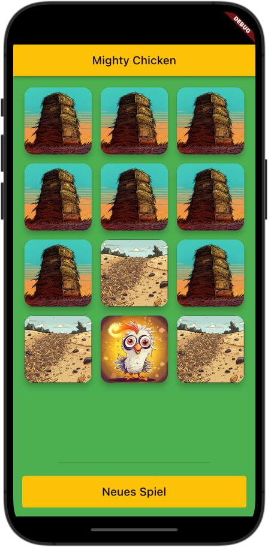

# Kapitel 3 - Programmlogik II

## Was wir lernen
 * Dart Packages 
 * Ton abspielen (cross-platform)
 * Tieferer Einbilck in Funktionen
 * Listen
 * initState
 * if-else Verzweigungen
 * Funktionstypen
   - Ohne Rückgabe `void`
   - Mit Rückgabe
   - Mit Parametern
 * Arrow Funktionen
 * GridView

## Was wir programmieren

 * Mighty Chicken

     

    Bei Mighty Chicken geht es darum das "Mighty Chicken" in einem der Heuhaufen zu finden.  
    Sobald die Nutzer:in einen Heuhaufen anklickt, wird angezeigt, ob das Mighty Chicken sich dort versteckt hielt und ein passender Ton abgespielt.  


## Mighty Chicken - Step 1
Wir fangen zunächst mit dem leeren App-Gerüst an.
Wir können dazu entweder, die App, die bei Initialisierung des Flutterprojektes erstellt wurde, verwenden oder wir leeren die `main.dart` und erstellen mit `stless` und `stful` Die nötigen Widgets. Dein Code sollte dann so aussehen:

<details>
<summary>Code</summary>

```dart
import 'package:flutter/material.dart';


void main() {
  runApp(const MightyChickenApp());
}

class MightyChickenApp extends StatelessWidget {
  const MightyChickenApp({super.key});

  @override
  Widget build(BuildContext context) {
    return MaterialApp(
      title: 'Mighty Chicken',
      theme: ThemeData(
        primarySwatch: Colors.amber,
      ),
      home: const MightyChickenPage(),
    );
  }
}

class MightyChickenPage extends StatefulWidget {
  const MightyChickenPage({super.key});

  @override
  State<MightyChickenPage> createState() => _MightyChickenPageState();
}

class _MightyChickenPageState extends State<MightyChickenPage> {
  @override
  Widget build(BuildContext context) {
    return SafeArea(
      child: Scaffold(
        backgroundColor: Colors.green,
        appBar: AppBar(
          title: Text('Mighty Chicken'),
        ),
        body: Placeholder(),
        ),
    );
  }
}

```
</details>

* Füge jetz auf bekannte Weise die Bilder in das Projekt ein.
* Im asset-Ordner findist du auch Ton-Dateien, die analog zu den Bildern eingefügt werden müssen:
    ```yaml
    assets:
      - assets/images/
      - assets/sounds/
    ```

## Mighty Chicken - Step 2

* Wie im Beispielbild zu sehen, sollen deu Heu-Stapel in einem Gitter-Muster angeordnet sein.
Hierfür können wir das [GridView-Widget](https://api.flutter.dev/flutter/widgets/GridView-class.html) verwenden: 

<details>
<summary>Code</summary>

```dart
GridView.count(
  primary: false,
  padding: const EdgeInsets.all(20),
  crossAxisSpacing: 10,
  mainAxisSpacing: 10,
  crossAxisCount: 2,
  children: <Widget>[
    Container(
      padding: const EdgeInsets.all(8),
      color: Colors.teal[100],
      child: const Text("Erster Heuhaufen"),
    ),
    Container(
      padding: const EdgeInsets.all(8),
      color: Colors.teal[200],
      child: const Text('Zweiter Heuhaufen'),
    ),
    Container(
      padding: const EdgeInsets.all(8),
      color: Colors.teal[300],
      child: const Text('Dritter Heuhaufen'),
    ),
    Container(
      padding: const EdgeInsets.all(8),
      color: Colors.teal[400],
      child: const Text('Vierter Heuhaufen'),
    ),
    Container(
      padding: const EdgeInsets.all(8),
      color: Colors.teal[500],
      child: const Text('Fünfter Heuhaufen'),
    ),
    Container(
      padding: const EdgeInsets.all(8),
      color: Colors.teal[600],
      child: const Text('Sechster Heuhaufen'),
    ),
  ],
)
```
</details>

`primary`: Der `primary`-Parameter ist ein optionaler boolescher Wert, der angibt, ob das `GridView` in der Hauptachse (häufig die vertikale Achse) scrollen soll. Wenn `primary` auf true gesetzt ist (Standardwert), wird das `GridView` auf die gesamte Größe des verfügbaren Raums in der Hauptachse ausgedehnt und ermöglicht das Scrollen. Wenn `primary` auf false gesetzt ist, wird das `GridView` nur so groß wie nötig, um alle Kinder unterzubringen, und ermöglicht kein Scrollen. In deinem Beispiel ist `primary` auf false gesetzt, sodass das `GridView` in der Hauptachse nicht scrollt.

`crossAxisCount`: Der `crossAxisCount`-Parameter gibt die Anzahl der Spalten in einem `GridView` an. Es ist ein erforderlicher Parameter für den `GridView.count()`-Konstruktor. In deinem Beispiel ist `crossAxisCount` auf 2 gesetzt, sodass das `GridView` zwei Spalten hat. Das `GridView` positioniert dann seine Kinder in diesen Spalten.

* Verwende das GridView-Beispiel, um die Heuhaufen, wie in obiger Abbildung, anzuordnen. Du kannst folgenden Code als Vorlage für die Heuhaufen verwenden:

<details>
<summary>Code</summary>

```dart
TextButton(
      style: TextButton.styleFrom(
        padding: EdgeInsets.all(0),
      ),
      onPressed: () {},
      child: Card(
        elevation: 8,
        child: ClipRRect(
            child: Image.asset('assets/images/hay_stack.png'),
            borderRadius: BorderRadius.all(Radius.circular(16.0),
            ),
        ),
        shape: RoundedRectangleBorder(
          borderRadius: BorderRadius.all(
            Radius.circular(16.0),
          ),
        ),
      ),
    );
```
</details>


## Mighty Chicken - Step 3: Listen

An dieser Stelle wird auffällig, dass wir sehr oft den gleichen Code verwenden müssen. Zum Einen für die zwölf Heuhaufen und zum Anderen für die zwölf Bilder. Diese sollen sich ja durch antippen verändern.
Unsere Bilder sind diesmal nicht einfach mit einer Nummer versehen und dies wäre auch nicht sinnvoll, da wir ja zwölf mal das selbe Bild bei start das Spieles verwenden.

Eine Möglichkeit ist, jedem Heuhaufen eine eigene Variable für das Bild zuzuweisen:

```dart
String hayStack1 = 'assets/images/hay_stack.png';
String hayStack2 = 'assets/images/hay_stack.png';
...
String hayStack12 = 'assets/images/hay_stack.png';
```

Sobald die Nutzer:in dann auf einen Heuhaufen tippt, wird das Bild geändert:

```dart
hayStack1 = 'assets/images/mighty_chicken.png';
```

Das ist sehr unübersichtlich und wir müssen für jeden Heuhaufen eine eigene Variable anlegen. Außerdem müssen wir für jeden Heuhaufen eine eigene Methode schreiben, die das Bild ändert.

Statdessen können wir in Dart mit Listen arbeiten. Listen sind eine Sammlung von Objekten, die in einer bestimmten Reihenfolge gespeichert werden. Listen können beliebig groß sein und ihre Größe kann sich während der Laufzeit ändern.

Gehe auf https://dartpad.dev/ und kopiere den folgenden Code in das Dartpad:
```dart
void main() {
    List<String> einkaufsliste = ['Brot', 'Milch', 'Eier'];
    print(einkaufsliste);
}
```

Mit `<String>` haben wir angegeben, dass unsere Liste nur Objekte vom Typ String enthält. Die Liste wird in eckigen Klammern angegeben. Die einzelnen Elemente werden durch Kommata getrennt.

Wenn wir auf ein einzelnes Element zugreifen wollen, können wir dies über den Index tun. Der Index beginnt bei 0. Das erste Element hat also den Index 0, das zweite Element den Index 1 usw.

```dart
print(einkaufsliste[0]);
// Oder eingesetzt in einen String
print('Das zweite Element ist: ${einkaufsliste[1]}');
```

Listen lassen sich auch nachträglich noch verändern. Zum hinzufügen eines Elements an das Ende der Liste, können wir die `add()`-Methode verwenden:

```dart
einkaufsliste.add('Käse');
```
Um ein Element auszutauschen können wir auch wieder über den Index arbeiten:

```dart
einkaufsliste[1] = 'Wasser';
```

Um ein Element an einer bestimmten Stelle einzufügen, können wir die `insert()`-Methode verwenden:

```dart
einkaufsliste.insert(1, 'Butter');
```

Um ein bestimmtes Element zu entfernen, können wir die `remove()`-Methode verwenden:

```dart
einkaufsliste.remove('Butter');
```

Um ein Element an einer bestimmten Stelle zu entfernen, können wir die `removeAt()`-Methode verwenden:

```dart
einkaufsliste.removeAt(1);
```

Für die Bilder der Heuhaufen können wir nun eine Liste anlegen:

```dart
List<String> hayStacks = [
    'assets/images/hay_stack.png',
    'assets/images/hay_stack.png',
    'assets/images/hay_stack.png',
    'assets/images/hay_stack.png',
    'assets/images/hay_stack.png',
    'assets/images/hay_stack.png',
    'assets/images/hay_stack.png',
    'assets/images/hay_stack.png',
    'assets/images/hay_stack.png',
    'assets/images/hay_stack.png',
    'assets/images/hay_stack.png',
    'assets/images/hay_stack.png',
];
```

Wenn wir jetzt die Heuhaufen anlegen, können wir auf die Bilder über den Index zugreifen:

```dart

    TextButton(
      style: TextButton.styleFrom(
        padding: EdgeInsets.all(0),
      ),
      onPressed: () {},
      child: Card(
        elevation: 8,
        child: ClipRRect(
            child: Image.asset(_hayStacks[0]),
            borderRadius: BorderRadius.all(Radius.circular(16.0),
            ),
        ),
        shape: RoundedRectangleBorder(
          borderRadius: BorderRadius.all(
            Radius.circular(16.0),
          ),
        ),
      ),
    );

```

## Mighty Chicken - Step 4: Funktionen
Bisher haben wir nur Funktionen ohne Rückgabewert, sogenannte void-Funktionen kennengelernt. 

Funktionen können aber auch einen Rückgabewert haben. Dieser wird mit dem Schlüsselwort `return` zurückgegeben. 

```dart
int calculate(){
    return 5+4;
}

print(calculate());

int sum = calculate();
print('Die Summe ist: $sum');
```

Funktionen können auch Parameter, also Eingangswerte haben. Diese stehen dann der Funktion zur Verfügung.

```dart
int calculate(int a, int b){
    return a+b;
}

print(calculate(5,4));
print(calculate(10,4));

```

### Mighty Chicken - Step 4.1: Funktionen mit UI-Elementen als Rückgabewert
Die Material-Widgets sind Objekte die wir von einer Funktion zurückgeben lassen können:
Als Rückgabeweert können wir `Widget` angeben:

```dart
Widget styledText(String text){
    // Als Rückgabewert geben wir ein Text-Widget zurück.
    return Text(
        // Der Text wird aus dem Parameter text erzeugt.
        text,
        style: TextStyle(
            fontSize: 24,
            color: Colors.white,
            fontWeight: FontWeight.bold,
        ),
    );
}
```
Den so gestalteten Text können wir nun analog zu den anderen Widgets verwenden:

```dart
Center(
    child: styledText('Mighty Chicken'),
),
```

Auf diese Weise können wir nun auch unsere Karten erzeugen und haben einen wesentlich übersichtlicheren Code:

```dart
// Die Funktion gibt ein Widget vom Typ TextButton zurück.
// Sie nimmt als Parameter den Integer hayStack entgegen, welcher den Index des Heuhaufens (0,1,2...11) angibt.
Widget _buildHayStack(int hayStack) {
    return TextButton(
      style: TextButton.styleFrom(
        padding: EdgeInsets.all(0),
      ),
      // Die Funktion _revealHayStack wird aufgerufen, wenn der Button gedrückt wird.
      // Sie soll das Bild des Heuhaufens ersetzen: Entweder mit dem Bild des Mighty Chickens oder mit dem Bild eines leeren Heuhaufens.
      onPressed: () => _revealHayStack(hayStack),
      child: Card(
        elevation: 8,
        child: ClipRRect(
            // Setzt das Bild auf jenes des Heuhaufens mit dem Index hayStack.
            child: Image.asset(_hayStacks[hayStack]),
            borderRadius: BorderRadius.all(Radius.circular(16.0))),
        shape: RoundedRectangleBorder(
          borderRadius: BorderRadius.all(
            Radius.circular(16.0),
          ),
        ),
      ),
    );
  }
```

* Welchen Rückgabewert muss die Funktion `_revealHayStack()` haben?
* Erstelle die Funktion `_revealHayStack()`. Diese soll das Bild in `_hayStacks` an der Stelle `hayStack` gegen das Bild `nothing.png` austauschen.

<details>
<summary>Lösung</summary>

```dart
  void _revealHayStack(int hayStack) {
    // Setzt das Bild des Heuhaufens mit dem Index hayStack auf das Bild nothing.png.
    // Dies geschieht innerhalt der setState()-Methode, damit die Änderung auch angezeigt wird.
    setState(() {
      print('Haystack $hayStack revealed!');
      _hayStacks[hayStack] = 'assets/images/nothing.png';
      }
    });
  }
```
</details>

Nachdem wir nun die Funktionen `_buildHayStack()` und `_revealHayStack()` erstellt haben, können wir die Heuhaufen nun im `GridView` anzeigen:

```dart
GridView.count(
    primary: false,
    padding: const EdgeInsets.all(16),
    crossAxisSpacing: 8,
    mainAxisSpacing: 8,
    crossAxisCount: 3,
    children: <Widget>[
        _buildHayStack(0),
        _buildHayStack(1),
        _buildHayStack(2),
        _buildHayStack(3),
        _buildHayStack(4),
        _buildHayStack(5),
        _buildHayStack(6),
        _buildHayStack(7),
        _buildHayStack(8),
        _buildHayStack(9),
        _buildHayStack(10),
        _buildHayStack(11),
    ],
),
```

Dein Code sollte nun so aussehen:

<details>
<summary>Code</summary>

```dart
import 'dart:math';
import 'package:audioplayers/audioplayers.dart';
import 'package:flutter/material.dart';


void main() {
  runApp(const MightyChickenApp());
}

class MightyChickenApp extends StatelessWidget {
  const MightyChickenApp({super.key});

  // This widget is the root of your application.
  @override
  Widget build(BuildContext context) {
    return MaterialApp(
      title: 'Mighty Chicken',
      theme: ThemeData(
        primarySwatch: Colors.amber,
      ),
      home: const MightyChickenPage(),
    );
  }
}

class MightyChickenPage extends StatefulWidget {
  const MightyChickenPage({super.key});

  @override
  State<MightyChickenPage> createState() => _MightyChickenPageState();
}

class _MightyChickenPageState extends State<MightyChickenPage> {

  List<String> _hayStacks = [];


  void _resetGame() {
    setState(() {
      _hayStacks = [
        'assets/images/hay_stack.png',
        'assets/images/hay_stack.png',
        'assets/images/hay_stack.png',
        'assets/images/hay_stack.png',
        'assets/images/hay_stack.png',
        'assets/images/hay_stack.png',
        'assets/images/hay_stack.png',
        'assets/images/hay_stack.png',
        'assets/images/hay_stack.png',
        'assets/images/hay_stack.png',
        'assets/images/hay_stack.png',
        'assets/images/hay_stack.png',
      ];
      _chickenPosition = Random().nextInt(12);
    });
  }

  void _revealHayStack(int hayStack) {
    setState(() {
      print('Haystack $hayStack revealed!');
     _hayStacks[hayStack] = 'assets/images/nothing.png';
    });
  }

  Widget _buildHayStack(int hayStack) {
    return TextButton(
      style: TextButton.styleFrom(
        padding: EdgeInsets.all(0),
      ),
      onPressed: () => _revealHayStack(hayStack),
      child: Card(
        elevation: 8,
        child: ClipRRect(
            child: Image.asset(_hayStacks[hayStack]),
            borderRadius: BorderRadius.all(Radius.circular(16.0))),
        shape: RoundedRectangleBorder(
          borderRadius: BorderRadius.all(
            Radius.circular(16.0),
          ),
        ),
      ),
    );
  }

  @override
  Widget build(BuildContext context) {
    return SafeArea(
      child: Scaffold(
        backgroundColor: Colors.green,
        appBar: AppBar(
          title: Text('Mighty Chicken'),
        ),
        body: Center(
          child: Column(
            mainAxisAlignment: MainAxisAlignment.center,
            crossAxisAlignment: CrossAxisAlignment.center,
            children: <Widget>[
              Expanded(
                child: GridView.count(
                  primary: false,
                  padding: const EdgeInsets.all(16),
                  crossAxisSpacing: 8,
                  mainAxisSpacing: 8,
                  crossAxisCount: 3,
                  children: <Widget>[
                        _buildHayStack(0),
                        _buildHayStack(1),
                        _buildHayStack(2),
                        _buildHayStack(3),
                        _buildHayStack(4),
                        _buildHayStack(5),
                        _buildHayStack(6),
                        _buildHayStack(7),
                        _buildHayStack(8),
                        _buildHayStack(9),
                        _buildHayStack(10),
                        _buildHayStack(11),
                  ],
                ),
              ),
            ],
          ),
        ),
      ),
    );
  }
}

```
</details>

## Step 5: if-else Verzweigungen
Als nächstes wollen wir das `Mighty Chicken` anzeigen. Dazu erstellen wir eine Variable `_chickenPosition` und initialisieren diese mit einer zufälligen Zahl zwischen 0 und 11. Diese Zahl entspricht dem Index des Heuhaufens, in dem sich der `Mighty Chicken` befindet.

```dart
    int _chickenPosition = Random().nextInt(12);
```

In unserer Funktion `_revealHayStack()` wollen wir nun prüfen, ob der `Mighty Chicken` in dem Heuhaufen ist, den der Spieler angetippt hat.

Immer dann wenn, wenn wir auf Grund von Variablen eine Bedingung prüfen, verwenden wir if-else Verzweigungen.

Wechsel wieder zu DartPad und füge folgenden Code ein:

```dart
    void main() {
        int number_1 = 12;
        int number_2 = 6;

        // Wenn number_1 größer als number_2 ist, dann ...
        if (number_1 > number_2) {
            print('number_1 is greater than number_2');
        // andernfalls
        } else {
            print('number_1 is smaller than number_2');
        }
    }
```

Zusätzlich gibt es nocht `else if ()`. Sollte die erste Bedingung nicht zugetroffen haben, wird die nächste `else if ()` geprüft. Es können beliebig viele `else if ()` verwendet werden. Die Abarbeitung erfolgt von oben nach unten und endet entweder mit dem zutreffen einer Bedingung oder mit dem `else` Block.

Der `else` und `else if` Block ist optional. Es kann auch nur ein `if` Block verwendet werden.

```dart
    void main() {
        int number_1 = 12;
        int number_2 = 6;
        int number_3 = 18;
        int number_4 = 6;

        // Wenn number_1 größer als number_2 ist, dann ...
        if (number_1 > number_2) {
            print('number_1 is greater than number_2');
        // andernfalls, wenn number_1 größer als number_3 ist, dann ...
        } else if (number_1 > number_3) {
            print('number_1 is greater than number_3');
        // andernfalls, wenn number_2 gleich number_4 ist, dann ...
        } else if (number_2 == number_4) {
            print('number_2 is equal to number_4');
        // andernfalls
        } else {
            print('number_1 is smaller than number_2 and number_3');
        }
    }
```

Mit diesen Grundlagen können wir nun in unserer Funktion `_revealHayStack()` prüfen, ob der `Mighty Chicken` in dem Heuhaufen ist, den der Spieler angetippt hat.

```dart
    void _revealHayStack(int hayStack) {
        setState(() {
            print('Haystack $hayStack revealed!');
            if (hayStack == _chickenPosition) {
                _hayStacks[hayStack] = 'assets/images/mighty_chicken.png';
            } else {
                _hayStacks[hayStack] = 'assets/images/nothing.png';
            }
        });
    }
```

## Step 6: initState() und @override

Füge nun noch den `Divider`, den "Neues Spiel"-`TextButton` und eine abschließende `SizedBox`dem Design hinzu:

```dart
Container(
    margin: EdgeInsets.symmetric(horizontal: 80, vertical: 16),
    child: Divider(
        thickness: 2,
    ),
),
Padding(
    padding: const EdgeInsets.symmetric(horizontal: 16.0),
    child: TextButton(
        onPressed: () => _resetGame(),
        child: Container(
        padding: EdgeInsets.all(8),
        width: double.infinity,
        child: Center(
                child: Text(
                "Neues Spiel",
                style: TextStyle(fontSize: 20, color: Colors.black),
                ),
            ),
        ),
        style: TextButton.styleFrom(backgroundColor: Colors.amber),
    ),
),
SizedBox(height: 16),
```

Wie im Code zu sehen ruft der `TextButton` die Funktion `_resetGame()` auf. Diese Funktion müssen wir noch erstellen.

`_resetGame` soll beim Starten des Spiels und nach tippen auf den "Neues Spiel"-`TextButton` aufgerufen werden. Dazu verwenden wir die `initState()` Funktion.
Die Funktion soll folgende Aufgaben erfüllen:
  - Alle 12 Heuhaufen wieder mit dem Bild "assets/images/haystack.png" befüllen.
  - Eine neue Position für das `Mighty Chicken` generieren.

  <details>
  <summary>Code</summary>

  ```dart
      void _resetGame() {
          setState(() {
              _chickenPosition = Random().nextInt(12);
              _hayStacks = [
                  'assets/images/haystack.png',
                  'assets/images/haystack.png',
                  'assets/images/haystack.png',
                  'assets/images/haystack.png',
                  'assets/images/haystack.png',
                  'assets/images/haystack.png',
                  'assets/images/haystack.png',
                  'assets/images/haystack.png',
                  'assets/images/haystack.png',
                  'assets/images/haystack.png',
                  'assets/images/haystack.png',
                  'assets/images/haystack.png',
              ];
          });
      }
  ```
</details>

Um die Funktion `_resetGame()` beim Starten des Spiels aufzurufen, können wir die vorhandene Funktion `initState()` überschreiben. Zum Überschreiben einer Funktion verwenden wir die `@override` Annotation.

```dart
    @override
    void initState() {
        super.initState();
        _resetGame();
    }
```

### initState()
In Flutter ist `initState` eine Funktion, die im Lebenszyklus eines `StatefulWidget` aufgerufen wird, wenn der State initialisiert wird. Hier kannst du Variablen initialisieren oder andere Aktionen ausführen, bevor das Widget zum ersten Mal aufgebaut wird.

#### super.initState()
`super.initState();` ist ein Aufruf der `initState()`-Methode der übergeordneten Klasse (Superklasse) in Flutter. Es wird normalerweise in der `initState()`-Methode einer Unterklasse von State verwendet, um sicherzustellen, dass die Implementierung der `initState()`-Methode in der Superklasse ordnungsgemäß ausgeführt wird, bevor benutzerdefinierter Code in der Unterklasse ausgeführt wird.

Die `initState()`-Methode wird aufgerufen, wenn ein State-Objekt erstellt wird und bevor das zugehörige Widget in den Widget-Baum eingefügt wird. Es ist ein guter Ort, um die anfängliche Einrichtung für das State-Objekt durchzuführen, wie das Initialisieren von Variablen oder das Starten von Animationen.

Da Flutter ein hierarchisches Framework ist, erben viele Klassen von anderen Klassen. Wenn du die `initState()`-Methode in einer Unterklasse überschreibst, solltest du `super.initState();` aufrufen, um sicherzustellen, dass die `initState()`-Methode der Superklasse ausgeführt wird und alle erforderlichen Initialisierungen in der Superklasse durchgeführt werden.


### @override
`@override` ist eine Annotation in Dart, die verwendet wird, um explizit anzugeben, dass eine Methode in einer Unterklasse die Implementierung einer Methode in der übergeordneten Klasse überschreibt. Die Verwendung von `@override` ist optional, aber es ist eine gute Praxis, sie zu verwenden, um den Code klarer und weniger fehleranfällig zu machen.

Wenn du `@override` verwendest, teilst du dem Dart-Compiler und anderen Entwicklern mit, dass du beabsichtigst, eine Methode aus der übergeordneten Klasse zu überschreiben. Wenn die Methode in der übergeordneten Klasse nicht existiert oder wenn sie in der Unterklasse nicht korrekt überschrieben wurde (z. B. aufgrund eines Tippfehlers im Methodennamen), gibt der Compiler einen Fehler aus.

In Flutter wirst du häufig `@override` verwenden, wenn du benutzerdefinierte Widgets erstellst, die von den vordefinierten Flutter-Widgets wie StatefulWidget, State, StatelessWidget usw. erben.


## Step 7: Pakete installieren und Ton abspielen
Als letztes wollen wir noch, dass, je nachdem ob das `Mighty Chicken` gefunden wurde oder nicht, ein anderer Ton abgespielt wird. Dazu müssen wir noch ein paar Pakete installieren.

Wir gehen dafür auf die offizielle [Dart-Paketseite](https://pub.dev/packages) und suchen nach dem Paket `audioplayers`.

`audioplayers` ist ein beliebtes Flutter-Plugin, das es ermöglicht, Audio-Dateien abzuspielen. Es unterstützt die Wiedergabe von lokalen Assets, Dateien, URLs und Buffer. Es unterstützt auch die Wiedergabe von Audio-Dateien im Hintergrund.

Gehe wie im Abschnitt "Installing" beschrieben von und füge die folgenden Zeilen in die `pubspec.yaml` ein (wobei die Zeile `dependencies:` bereits vorhanden sein sollte):

```yaml
dependencies:
  audioplayers: ^3.0.1
```

Klick dann auf "Pub get" in der oberen rechten Ecke.
Damit hast du das audioplayers-Paket installiert und kannst es nutzen.

In der `main.dart` importierst du das Paket:

```dart
import 'package:audioplayers/audioplayers.dart';
```

Um den Player zu benutzen musst du eine Instanz von `AudioPlayer` erstellen:

```dart
AudioPlay player = AudioPlayer();
```

Jetzt kannst `player` benutzen um Audio-Dateien abzuspielen. Dazu gibt es die Funktion `play()`.

```dart
player.play('assets/sounds/chicken.mp3');
```

Ändere die Funktion `revealHayStack()` so ab, dass sie den Ton `assets/sounds/chicken.mp3` abspielt, wenn das `Mighty Chicken` gefunden wurde. Andernfalls soll der Ton `assets/sounds/cicada.mp3` abgespielt werden.  
Beachte: `AudioPlayer` sucht automatisch ab der Ordner-Ebene `assets` nach den Dateien.

<details>
<summary>Lösung</summary>

```dart
void _revealHayStack(int hayStack) {
    AudioPlayer player = AudioPlayer();
    setState(() {
      print('Haystack $hayStack revealed!');
      if (hayStack == _chickenPosition) {
        print('Chicken found!');
        player.play(AssetSource('sounds/chicken.mp3'));
        _hayStacks[hayStack] = 'assets/images/mighty_chicken.png';
      } else {
        player.play(AssetSource('sounds/cicada.mp3'));
        _hayStacks[hayStack] = 'assets/images/nothing.png';
      }
    });
  }
```

</details>

Dein Code sollte jetzt so aussehen:

<details>
<summary>Code</summary>

```dart
import 'dart:math';
import 'package:audioplayers/audioplayers.dart';
import 'package:flutter/material.dart';


void main() {
  runApp(const MightyChickenApp());
}

class MightyChickenApp extends StatelessWidget {
  const MightyChickenApp({super.key});

  // This widget is the root of your application.
  @override
  Widget build(BuildContext context) {
    return MaterialApp(
      title: 'Mighty Chicken',
      theme: ThemeData(
        primarySwatch: Colors.amber,
      ),
      home: const MightyChickenPage(),
    );
  }
}

class MightyChickenPage extends StatefulWidget {
  const MightyChickenPage({super.key});

  @override
  State<MightyChickenPage> createState() => _MightyChickenPageState();
}

class _MightyChickenPageState extends State<MightyChickenPage> {
  @override
  void initState() {
    super.initState();
    _resetGame();
  }

  List<String> _hayStacks = [];
  int _chickenPosition = 0;


  void _resetGame() {
    setState(() {
      _hayStacks = [
        'assets/images/hay_stack.png',
        'assets/images/hay_stack.png',
        'assets/images/hay_stack.png',
        'assets/images/hay_stack.png',
        'assets/images/hay_stack.png',
        'assets/images/hay_stack.png',
        'assets/images/hay_stack.png',
        'assets/images/hay_stack.png',
        'assets/images/hay_stack.png',
        'assets/images/hay_stack.png',
        'assets/images/hay_stack.png',
        'assets/images/hay_stack.png',
      ];
      _chickenPosition = Random().nextInt(12);
    });
  }

  void _revealHayStack(int hayStack) {
    AudioPlayer player = AudioPlayer();
    setState(() {
      print('Haystack $hayStack revealed!');
      if (hayStack == _chickenPosition) {
        print('Chicken found!');
        player.play(AssetSource('sounds/chicken.mp3'));
        _hayStacks[hayStack] = 'assets/images/mighty_chicken.png';
      } else {
        player.play(AssetSource('sounds/cicada.mp3'));
        _hayStacks[hayStack] = 'assets/images/nothing.png';
      }
    });
  }

  Widget _buildHayStack(int hayStack) {
    return TextButton(
      style: TextButton.styleFrom(
        padding: EdgeInsets.all(0),
      ),
      onPressed: () => _revealHayStack(hayStack),
      child: Card(
        elevation: 8,
        child: ClipRRect(
            child: Image.asset(_hayStacks[hayStack]),
            borderRadius: BorderRadius.all(Radius.circular(16.0))),
        shape: RoundedRectangleBorder(
          borderRadius: BorderRadius.all(
            Radius.circular(16.0),
          ),
        ),
      ),
    );
  }

  @override
  Widget build(BuildContext context) {
    return SafeArea(
      child: Scaffold(
        backgroundColor: Colors.green,
        appBar: AppBar(
          title: Text('Mighty Chicken'),
        ),
        body: Center(
          child: Column(
            mainAxisAlignment: MainAxisAlignment.center,
            crossAxisAlignment: CrossAxisAlignment.center,
            children: <Widget>[
              Expanded(
                child: GridView.count(
                  primary: false,
                  padding: const EdgeInsets.all(16),
                  crossAxisSpacing: 8,
                  mainAxisSpacing: 8,
                  crossAxisCount: 3,
                  children: <Widget>[
                        _buildHayStack(0),
                        _buildHayStack(1),
                        _buildHayStack(2),
                        _buildHayStack(3),
                        _buildHayStack(4),
                        _buildHayStack(5),
                        _buildHayStack(6),
                        _buildHayStack(7),
                        _buildHayStack(8),
                        _buildHayStack(9),
                        _buildHayStack(10),
                        _buildHayStack(11),
                  ],
                ),
              ),
              Container(
                margin: EdgeInsets.symmetric(horizontal: 80, vertical: 16),
                child: Divider(
                  thickness: 2,
                ),
              ),
              Padding(
                padding: const EdgeInsets.symmetric(horizontal: 16.0),
                child: TextButton(
                  onPressed: () => _resetGame(),
                  child: Container(
                    padding: EdgeInsets.all(8),
                    width: double.infinity,
                    child: Center(
                      child: Text(
                        "Neues Spiel",
                        style: TextStyle(fontSize: 20, color: Colors.black),
                      ),
                    ),
                  ),
                  style: TextButton.styleFrom(backgroundColor: Colors.amber),
                ),
              ),
              SizedBox(height: 16),
            ],
          ),
        ),
      ),
    );
  }
}

```

</details>


Neue Widgets:
| Widget    | Dokumentation                                              |
|-----------|------------------------------------------------------------|
| GridView  | [GridView Docs](https://api.flutter.dev/flutter/widgets/GridView-class.html


</details>
* Sound Effekte von <a href="https://pixabay.com/?utm_source=link-attribution&amp;utm_medium=referral&amp;utm_campaign=music&amp;utm_content=33515">Pixabay</a>
