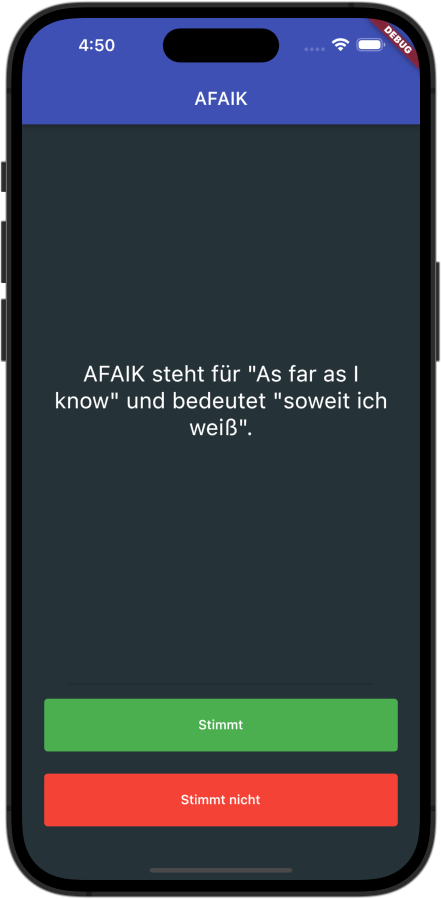

# Kapitel 4 - Programmlogik III

## Was wir lernen
 * Vertiefung:
    * Listen
    * if-else Verzweigungen (Conditionals)
 * Klassen
 * Abstraktion
 * Verkapselung
 * Vererbung
 * Polymorphismus

## Was wir programmieren

| AFAIK - "As far as I know" ist eine App in der die Spieler:in ihr Wissen durch beantworten von Fragen prüfen kann |
|------------------------------------------------------------------------------------|
|   |

## AFAIK Step 1 - Initialisierung

* Für einen leichten Einstieg, kann dieser Code als Basis verwendet werden:

<details>
<summary>Code</summary>

```dart
import 'package:flutter/material.dart';

void main() {
  runApp(const AfaikApp());
}

class AfaikApp extends StatelessWidget {
  const AfaikApp({super.key});

  // This widget is the root of your application.
  @override
  Widget build(BuildContext context) {
    return MaterialApp(
      title: 'Flutter Demo',
      theme: ThemeData(
        primarySwatch: Colors.indigo,
      ),
      home: const AfaikPage(),
    );
  }
}

class AfaikPage extends StatefulWidget {
  const AfaikPage({super.key});

  @override
  State<AfaikPage> createState() => _AfaikPageState();
}

class _AfaikPageState extends State<AfaikPage> {
  @override
  Widget build(BuildContext context) {
    return Scaffold(
      backgroundColor: Colors.blueGrey[900],
      appBar: AppBar(
        title: Text('AFAIK'),
      ),
      body: SafeArea(
        child: Column(
          mainAxisAlignment: MainAxisAlignment.center,
          crossAxisAlignment: CrossAxisAlignment.stretch,

          children: [
            Expanded(
              child: Center(
                child: Padding(
                  padding: const EdgeInsets.symmetric(horizontal: 32.0),
                  child: Text(
                    textAlign: TextAlign.center,
                    'AFAIK steht für "As far as I know" und bedeutet "soweit ich weiß".',
                    style: TextStyle(color: Colors.white, fontSize: 24),
                  ),
                ),
              ),
            ),
            Container(
              margin: EdgeInsets.symmetric(horizontal: 50),
              child: Divider(
                thickness: 2,
              ),
            ),
            // Stimmt Button
            Padding(
              padding: const EdgeInsets.only(bottom: 8.0, left: 16.0, right: 16.0),
              child: TextButton(
                onPressed: () {},
                child: Container(
                  decoration: BoxDecoration(
                    borderRadius: BorderRadius.circular(4),
                    color: Colors.green,
                  ),
                  padding: EdgeInsets.symmetric(vertical: 20),
                  child: Center(
                    child: Text(
                      'Stimmt',
                      style:
                          TextStyle(color: Colors.white),
                    ),
                  ),
                ),
              ),
            ),
            // Stimmt nicht Button
            Padding(
              padding: const EdgeInsets.only(bottom: 16.0, left: 16.0, right: 16.0),
              child: TextButton(
                onPressed: () {},
                child: Container(
                  decoration: BoxDecoration(
                    borderRadius: BorderRadius.circular(4),
                    color: Colors.red,
                  ),
                  padding: EdgeInsets.symmetric(vertical: 20),
                  child: Center(
                    child: Text(
                      'Stimmt nicht',
                      style:
                          TextStyle(color: Colors.white),
                    ),
                  ),
                ),
              ),
            ),
          ],
        ),
      ),
    );
  }
}


```

</details>

## AFAIK Step 2 - Antwortübersicht

* Füge über der Frage eine `Row`, sowie einen `Divider` hinzu.
In der `Row` wollen wir später mit `Icons` anzeigen, ob die Antwort richtig oder falsch war. Gib der Row ein links und rechts ein Padding von 16.0, von oben eines von 8.0.

<details>
<summary>Lösung</summary>

```dart
Padding(
    padding: const EdgeInsets.only(left: 16.0, right: 16.0, top: 8.0),
    child: Row(
        mainAxisAlignment: MainAxisAlignment.start,
        children: [],
    ),
),
Divider(
    thickness: 2,
),
```

</details>

* Jetzt da wir eine `Row` für unsere Antworten haben, können wir unter `children` `Icons` hinzufügen:

```dart
children: [
    Icon(
        Icons.check,
        color: Colors.green,
    ),
    Icon(
        Icons.close,
        color: Colors.red,
    ),
    Icon(
        Icons.check,
        color: Colors.green,
    ),
    Icon(
        Icons.close,
        color: Colors.red,
    ),
    Icon(
        Icons.check,
        color: Colors.green,
    ),
    Icon(
        Icons.close,
        color: Colors.red,
    ),
],
```

* Überlege jetzt, wie du die Icons dynamisch hinzufügen kannst. Dazu kannst du dir noch einmal die `List` Klasse anschauen.

<details>
<summary>Lösung</summary>

```dart
List<Widget> _answers = [];
```
Wir können nun anstelle der Icons unter `children` nun diese `List` verwenden:

```dart
children: _answers,
```

Das geht, da children eine `List` von `Widget` erwartet.
</details>


* Nun müssen wir nur noch die Icons hinzufügen, wenn die Nutzer:in auf einer der Buttons drückt. Dazu müssen wir die `onPressed` Funktionen der Buttons anpassen:

```dart
onPressed: () {
    setState(() {
        _answers.add(
            Icon(
                Icons.check,
                color: Colors.green,
            ),
        );
    });
},
```
* Da wir bei jedem drücke eines Buttons, egal ob die Nutzerin nun auf "Stimmt" oder "Stimmt nicht" drückt prüfen wollen, ob die Antwort richtig ist, ist es sinnvoll, die Prüfung in eine eigene Funktion auszulagern:

* Wie könnte eine solche Funktion aussehen?
  - Benötigt sie Parameter?
  - Was soll sie zurückgeben?
  - Und was passiert in der Funktion?

<details>
<summary>Lösung</summary>

```dart
void _checkAnswer(bool answer) {
    setState(() {
        if (answer) {
            _answers.add(
                Icon(
                    Icons.check,
                    color: Colors.green,
                ),
            );
        } else {
            _answers.add(
                Icon(
                    Icons.close,
                    color: Colors.red,
                ),
            );
        }
    });
}
```
Diese vorläufige Version prüft nur, ob die übergebene Antwort `true` also wahr ist oder nicht. Die eigentliche Logik zur Prüfung der Antwort wird, erarbeiten wir später.

</details>

* Wo und wie müssen wir nun die Funktion aufrufen?

<details>
<summary>Lösung</summary>

```dart
// Stimmt Button
onPressed: () {
    _checkAnswer(true);
},

// Stimmt nicht Button
onPressed: () {
    _checkAnswer(false);
},
```
Wir rufen die Funktion nun auf, wenn die Nutzer:in auf einen der Buttons drückt.

</details>

Dein Code sollte nun so aussehen:

<details>
<summary>Code</summary>

```dart
import 'package:flutter/material.dart';

void main() {
  runApp(const AfaikApp());
}

class AfaikApp extends StatelessWidget {
  const AfaikApp({super.key});

  // This widget is the root of your application.
  @override
  Widget build(BuildContext context) {
    return MaterialApp(
      title: 'Flutter Demo',
      theme: ThemeData(
        primarySwatch: Colors.indigo,
      ),
      home: const AfaikPage(),
    );
  }
}

class AfaikPage extends StatefulWidget {
  const AfaikPage({super.key});

  @override
  State<AfaikPage> createState() => _AfaikPageState();
}

class _AfaikPageState extends State<AfaikPage> {

  List<Widget> _answers = [];

  void _checkAnswer(bool answer) {
    setState(() {
      if (answer) {
        _answers.add(
          Icon(
            Icons.check,
            color: Colors.green,
          ),
        );
      } else {
        _answers.add(
          Icon(
            Icons.close,
            color: Colors.red,
          ),
        );
      }
    });
  }

  @override
  Widget build(BuildContext context) {
    return Scaffold(
      backgroundColor: Colors.blueGrey[900],
      appBar: AppBar(
        title: Text('AFAIK'),
      ),
      body: SafeArea(
        child: Column(
          mainAxisAlignment: MainAxisAlignment.center,
          crossAxisAlignment: CrossAxisAlignment.stretch,

          children: [
            Padding(
              padding: const EdgeInsets.only(left: 16.0, right: 16.0, top: 8.0),
              child: SingleChildScrollView(
                scrollDirection: Axis.horizontal,
                child: Row(
                  mainAxisAlignment: MainAxisAlignment.start,
                  children: _answers,
                ),
              ),
            ),
            Divider(
              thickness: 2,
            ),
            Expanded(
              child: Center(
                child: Padding(
                  padding: const EdgeInsets.symmetric(horizontal: 32.0),
                  child: Text(
                    textAlign: TextAlign.center,
                    'AFAIK steht für "As far as I know" und bedeutet "soweit ich weiß".',
                    style: TextStyle(color: Colors.white, fontSize: 24),
                  ),
                ),
              ),
            ),
            Container(
              margin: EdgeInsets.symmetric(horizontal: 50),
              child: Divider(
                thickness: 2,
              ),
            ),
            // Stimmt Button
            Padding(
              padding: const EdgeInsets.only(bottom: 8.0, left: 16.0, right: 16.0),
              child: TextButton(
                onPressed: () => _checkAnswer(true),
                child: Container(
                  decoration: BoxDecoration(
                    borderRadius: BorderRadius.circular(4),
                    color: Colors.green,
                  ),
                  padding: EdgeInsets.symmetric(vertical: 20),
                  child: Center(
                    child: Text(
                      'Stimmt',
                      style:
                          TextStyle(color: Colors.white),
                    ),
                  ),
                ),
              ),
            ),
            // Stimmt nicht Button
            Padding(
              padding: const EdgeInsets.only(bottom: 16.0, left: 16.0, right: 16.0),
              child: TextButton(
                onPressed: () => _checkAnswer(false),
                child: Container(
                  decoration: BoxDecoration(
                    borderRadius: BorderRadius.circular(4),
                    color: Colors.red,
                  ),
                  padding: EdgeInsets.symmetric(vertical: 20),
                  child: Center(
                    child: Text(
                      'Stimmt nicht',
                      style:
                          TextStyle(color: Colors.white),
                    ),
                  ),
                ),
              ),
            ),
          ],
        ),
      ),
    );
  }
}

```

</details>

### AFAIK Step 3: Liste mit Fragen und Antworten

Die App soll nach dem Start und nach jeder Antwort eine neue Frage anzeigen. Dazu benötigen wir eine Liste mit Fragen.

* Erstelle eine Liste `_questions` mit Fragen. Du kannst dir hierfür die unten stehenden Fragen verweden oder eigene Fragen erstellen.

| Frage | Richtig/Falsch |
| --- | --- |
| AFAIK steht für "As far as I know" und bedeutet "soweit ich weiß". | Richtig |
| Kassel ist die Waschbärhauptstadt Europas. | Richtig |
| In der Nordsee gibt es keine Haie. | Falsch |
| Durchschnittlich isst der Mensch acht Spinnen im Schlaf. | Falsch |
| Hühner können nicht fliegen. | Falsch |
| Löwen springen bis zu 10 Meter weit. | Richtig |

<details>
<summary>Lösung</summary>

```dart
List<String> _questions = [
    'AFAIK steht für "As far as I know" und bedeutet "soweit ich weiß".',
    'Kassel ist die Waschbärhauptstadt Europas.',
    'In der Nordsee gibt es keine Haie.',
    'Durchschnittlich isst der Mensch acht Spinnen im Schlaf.',
    'Hühner können nicht fliegen.',
    'Löwen springen bis zu 10 Meter weit.',
];
```
</details>

Ersetze nun die Frage in der App durch die erste Frage aus der Liste.

<details>
<summary>Lösung</summary>

```dart
Text(
    _questions[0],
    ...
),
```
</details>

Um zu wissen, welche Frage wir als nächstes anzeigen, benötigen wir eine Variable, die den Index der aktuellen Frage speichert.


* Erstelle eine Variable `_currentQuestionIndex`, die den Index der aktuellen Frage speichert.

<details>
<summary>Lösung</summary>

```dart
int _currentQuestionIndex = 0;
```
</details>

* Wo und wie wird die Variable verwendet?

<details>
<summary>Lösung</summary>
Die Variable wird in der Methode `_checkAnswer(bool answer)` verwendet, um den Index der nächsten Frage zu bestimmen.

Beachte, das for dem Anzeigen der nächsten Frage der Index um eins erhöht werden muss.
</details>

#### Erhöhen von Variablen
```dart
int counter = 0;
// Um eine Variable um einen bestimmten Wert zu erhöhen, kann der Operator += verwendet werden.

// Erhöht die Variable um 1
counter += 1;
print(counter); // 1

// Erhöht die Variable um 2
counter += 2;
print(counter); // 3

// Da Werte besonder häufig um 1 erhöht bzw. verringert werden, gibt es auch die verkürzten Operatoren ++ und --.

// Erhöht die Variable um 1
counter++; 
print(counter); // 4

// Verringert die Variable um 1
counter--; 
print(counter); // 3
```

* Passe die Funktion `_checkAnswer(bool answer)` und das `Text`-Widget so an, sodass die nächste Frage angezeigt wird.

<details>
<summary>Lösung</summary>

```dart
  void _checkAnswer(bool answer) {
    setState(() {
      if (answer) {
        _answers.add(
          Icon(
            Icons.check,
            color: Colors.green,
          ),
        );
      } else {
        _answers.add(
          Icon(
            Icons.close,
            color: Colors.red,
          ),
        );
      }
      _currentQuestionIndex++;
    });
  }
```
</details>


Wenn wir nun die App testen, wird uns bei jedem Klick auf den Button "Stimmt" oder "Stimmt nicht" eine neue Frage angezeigt. Allerdings wird die App nach der letzten Frage abstürzen: `Range error (index): Invalid value: Not in range 0..5, inclusive: 6`.  
Wir versuchen also, die Frage mit dem Index 6 aus der Liste zu laden, obwohl die der Index nur von 0 bis 6 geht.

Dieses Problem werden wir später lösen.

#### List mit Antworten
Wir haben in Schritt drei eine Liste mit Fragen erstellt. Um zu prüfen ob die gegebenen Antworten richtig oder falsch sind, benötigen wir eine Liste mit Antworten.

* Lege eine Liste `_correctAnswers` an, die die Antworten richtige Antworten enthält.

<details>
<summary>Lösung</summary>

```dart
List<bool> _correctAnswers = [
    true,
    true,
    false,
    false,
    false,
    true,
];
```
</details>

Nun können wir in den Funktion `checkAnser(bool answer)`überprüfen, ob die gegebene Antwort richtig oder falsch ist und das entsprechende Icon setzen.

* Passe die Funktion `_checkAnswer(bool answer)` so an, dass die richtige Antwort aus der Liste `_correctAnswers` verwendet wird.

Du kannst die vorhandenen Logik verwenden und erweitern. 

Hinweis: Wenn du zwei Variablen vergleichen möchtest, kannst du das genau so machen wie in den Beispielen aus Kapitel 3; mit dem Gleichheits-Operator `==`.

```dart
bool userAnswer = true;
bool correctAnswer = true;

// Prüft ob die beiden Variablen den gleichen Wert haben
if (userAnswer == correctAnswer) {
    print('Die Antwort ist richtig');
} else {
    print('Die Antwort ist falsch');
}
```

<details>
<summary>Lösung</summary>

```dart
  void _checkAnswer(bool answer) {
    setState(() {
      if (answer == _correctAnswers[_currentQuestionIndex]) {
        _answers.add(
          Icon(
            Icons.check,
            color: Colors.green,
          ),
        );
      } else {
        _answers.add(
          Icon(
            Icons.close,
            color: Colors.red,
          ),
        );
      }
      _currentQuestionIndex++;
    });
  }
```
</details>


### Klassen

Zwar können wir nun prüfen, ob die gegebene Antwort richtig oder falsch ist, allerdings ist das Pflegen zweier Listen sehr Fehler anfällig. Sollte eine Frage aus der Liste gestrichen werden so muss auch genau die richtige Antwort aus der Liste entfernt werden.

Um das zu verhindern, können wir eine Klasse erstellen, die die Frage und die Antwort beinhaltet.
Ähnlich wie die uns bekannten Widgets, welche Eigenschaften und Methoden haben, können wir auch eigene Klassen erstellen, die Eigenschaften und Methoden haben.

* Erstelle eine neue Dart-Datei `question.dart` im Ordner `lib`.

In dieser Datei erstellen wir eine neue Klasse `Question`.

```dart
class Question {
    
}
```

Eine neue Klasse wird mit dem Schlüsselwort `class` erstellt.
Der Name der Klasse folgt auf das Schlüsselwort `class` und fängt mir einem Großbuchstaben an.

Der Klasse geben wir nun die beiden Eigenschaftten, die wir hier hin auslagern wollten:

```dart
class Question {
    String question = "";
    bool answer = false;
}
```

Als nächste erstellen wir einen Konstruktor, der die Eigenschaften der Klasse initialisiert.
Wir geben den Parametern des Konstruktors Standardwerte mit, sodass diese immer gesetzt sind.

```dart
class Question {
    String question = "";
    bool answer = false;

    Question({String q="", bool a=false}) {
        question = q;
        answer = a;
    }
}
```

Der Konstruktor wird mit dem Namen der Klasse und den Parametern der Klasse erstellt.
Dieser wird aufgerufen, wenn eine neue Instanz der Klasse erstellt wird.

* Gehe wieder zu DartPad (https://dartpad.dartlang.org/) und kopiere folgenden Code in das DartPad.

```dart
// Erstellen einer Klasse
class Question {
    // Eigenschaften der Klasse
    String question = "";
    bool answer = false;

    // Konstruktor der Klasse
    Question({String q="", bool a=false}) {
        question = q;
        answer = a;
    }

    Questtion(String q, bool a) {
        question = q;
        answer = a;
    }

}


void main() {

  // Antwort der Nutzer:in
  bool userAnswer = false;

  // Neues Objekt der Klasse Question
  Question q1 = Question(q: 'Schweine können nicht fliegen.', a: true);

  // Keine Antwort angegeben. Es wird der hinterlegte Standardwert (false) verwendet.
  Question q2 = Question(q: 'Mehr als vier Tassen Kaffee am Tag sind tödlich.');

  // Verwendet den zweiten Koknstruktor der Klasse Question
  Question q3 = Question('Flautiere können ihren Atem länger anhalten als Delfine', true);
  
  // Ausgabe der Fragen und Antworten
  print(q1.question);
  print(q1.answer);

  print(q2.question);
  print(q2.answer);
  
  // Prüfen der Antworten
  if ( userAnswer == q1.answer) {
    print('Richtig getippt!');
  } else {
    print('Da liegst du leider falsch.');
  }

  if ( userAnswer == q2.answer) {
    print('Richtig getippt!');
  } else {
    print('Da liegst du leider falsch.');
  }
  
}
```
Um in userer App auf die Klassen `Question` zuzugreifen, müssen wir diese in die Datei `main.dart` importieren.

* Füge folgenden Code am Anfang der Datei `main.dart` ein.

```dart
import 'question.dart';
``` 

* Erstelle nun ein Question-Objekt für die erste Frage und speichere es in der Variable `q1`.

```dart
Question q1 = Question(q: 'AFAIK steht für "As far as I know" und bedeutet "soweit ich weiß".', a: true);
```

* Passe deinen Code so an, dass die Liste `_questions` aus Objekten der Klasse `Question` besteht.

<details>
<summary>Lösung - Gesamter Code</summary>

```dart
import 'package:flutter/material.dart';
import 'question.dart';

void main() {
  runApp(const AfaikApp());
}

class AfaikApp extends StatelessWidget {
  const AfaikApp({super.key});

  // This widget is the root of your application.
  @override
  Widget build(BuildContext context) {
    return MaterialApp(
      title: 'Flutter Demo',
      theme: ThemeData(
        primarySwatch: Colors.indigo,
      ),
      home: const AfaikPage(),
    );
  }
}

class AfaikPage extends StatefulWidget {
  const AfaikPage({super.key});

  @override
  State<AfaikPage> createState() => _AfaikPageState();
}

class _AfaikPageState extends State<AfaikPage> {

  int _currentQuestionIndex = 0;
  List<Widget> _answers = [];

  List<Question> _questions = [
    Question(q: 'AFAIK steht für "As far as I know" und bedeutet "soweit ich weiß".', a: true),
    Question(q: 'Kassel ist die Waschbärhauptstadt Europas.', a: true),
    Question(q: 'In der Nordsee gibt es keine Haie.', a: false),
    Question(q: 'Durchschnittlich isst der Mensch acht Spinnen im Schlaf.', a: false),
    Question(q: 'Hühner können nicht fliegen.', a: false),
    Question(q: 'Löwen springen bis zu 10 Meter weit.', a: true),
  ];


  void _checkAnswer(bool answer) {
    setState(() {
      if (answer == _questions[_currentQuestionIndex].questionAnswer) {
        _answers.add(
          Icon(
            Icons.check,
            color: Colors.green,
          ),
        );
      } else {
        _answers.add(
          Icon(
            Icons.close,
            color: Colors.red,
          ),
        );
      }
      _currentQuestionIndex++;
    });
  }

  @override
  Widget build(BuildContext context) {
    return Scaffold(
      backgroundColor: Colors.blueGrey[900],
      appBar: AppBar(
        title: Text('AFAIK'),
      ),
      body: SafeArea(
        child: Column(
          mainAxisAlignment: MainAxisAlignment.center,
          crossAxisAlignment: CrossAxisAlignment.stretch,

          children: [
            Padding(
              padding: const EdgeInsets.only(left: 16.0, right: 16.0, top: 8.0),
              child: SingleChildScrollView(
                scrollDirection: Axis.horizontal,
                child: Row(
                  mainAxisAlignment: MainAxisAlignment.start,
                  children: _answers,
                ),
              ),
            ),
            Divider(
              thickness: 2,
            ),
            Expanded(
              child: Center(
                child: Padding(
                  padding: const EdgeInsets.symmetric(horizontal: 32.0),
                  child: Text(
                    textAlign: TextAlign.center,
                    _questions[_currentQuestionIndex].questionText,
                    style: TextStyle(color: Colors.white, fontSize: 24),
                  ),
                ),
              ),
            ),
            Container(
              margin: EdgeInsets.symmetric(horizontal: 50),
              child: Divider(
                thickness: 2,
              ),
            ),
            // Stimmt Button
            Padding(
              padding: const EdgeInsets.only(bottom: 8.0, left: 16.0, right: 16.0),
              child: TextButton(
                onPressed: () => _checkAnswer(true),
                child: Container(
                  decoration: BoxDecoration(
                    borderRadius: BorderRadius.circular(4),
                    color: Colors.green,
                  ),
                  padding: EdgeInsets.symmetric(vertical: 20),
                  child: Center(
                    child: Text(
                      'Stimmt',
                      style:
                          TextStyle(color: Colors.white),
                    ),
                  ),
                ),
              ),
            ),
            // Stimmt nicht Button
            Padding(
              padding: const EdgeInsets.only(bottom: 16.0, left: 16.0, right: 16.0),
              child: TextButton(
                onPressed: () => _checkAnswer(false),
                child: Container(
                  decoration: BoxDecoration(
                    borderRadius: BorderRadius.circular(4),
                    color: Colors.red,
                  ),
                  padding: EdgeInsets.symmetric(vertical: 20),
                  child: Center(
                    child: Text(
                      'Stimmt nicht',
                      style:
                          TextStyle(color: Colors.white),
                    ),
                  ),
                ),
              ),
            ),
          ],
        ),
      ),
    );
  }
}

```
</details>

